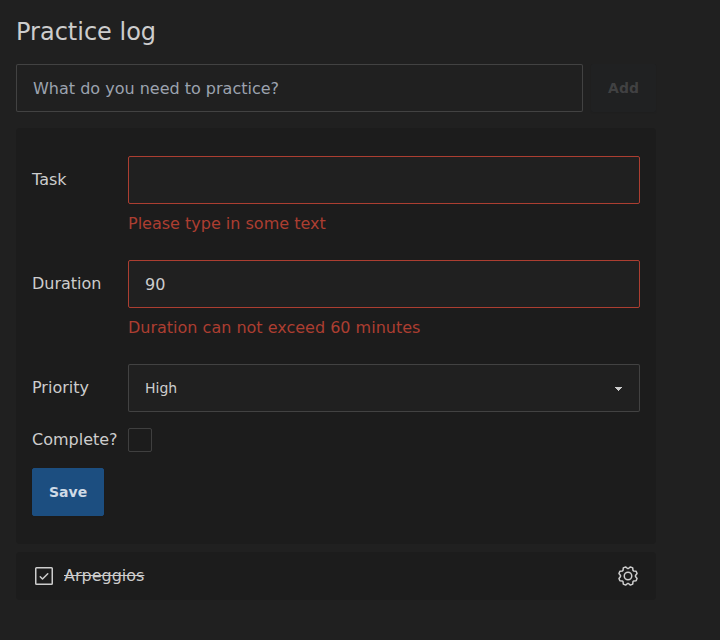

# Data-driven first class forms

> Adapted for Reagent + re-frame from [Data-driven first class forms](https://replicant.fun/tutorials/first-class-forms/)
> by Christian Johansen. The code for this tutorial is in [`code/first-class-forms`](../code/first-class-forms/).

This is the second of three tutorials on handling forms with data. The
[first one](./forms.md) gave each form field its own event handler. This time
we'll make the *form* the unit we work with: read all of its fields at once,
validate the result, and submit it, with forms as a first-class concept in
the code base.

In this tutorial:

- [Rendering the form](#rendering-the-form)
- [Extracting form data](#extracting-form-data)
- [Submitting the form](#submitting-the-form)
- [Validation](#validation)
- [Final touches](#final-touches)

## Setup

We continue where [the first form tutorial](./forms.md) left off. If you
followed along, keep going with your code. Otherwise, copy
[`code/forms`](../code/forms/) and start it:

```sh
cp -r code/forms practice-log
cd practice-log
npm install
npx tailwindcss -i ./src/main.css -o ./resources/public/tailwind.css --watch
```

And in another terminal:

```sh
npx shadow-cljs watch app
```

Open http://localhost:8080. Tests run with `clojure -M:dev -m kaocha.runner`.

A short recap, in case this is the first tutorial you read here:

- The app uses [Reagent](https://reagent-project.github.io/) to render
  [hiccup](../guides/data-driven-reagent.md#hiccup) and
  [re-frame](https://day8.github.io/re-frame/) to manage state. All state
  lives in one map, **app-db**, and only changes through **events** like
  `[:store/assoc-in [:tasks 1 :task/complete?] true]`.
- Views are pure functions from app-db to hiccup. Their event handlers are
  data, which the `datadriven.hiccup` namespace turns into functions that
  dispatch re-frame events. See
  [Event handlers as data](../guides/data-driven-reagent.md#event-handlers-as-data).
- Tasks are stored in app-db keyed by id:
  `{:tasks {1 {:task/id 1 :task/name "Major scales" ,,,}}}`. The original
  tutorials use [Datascript](https://github.com/tonsky/datascript) instead of
  a map. This port uses app-db like most re-frame apps do, and says so where
  that changes the design.
- The dev build logs every re-frame event to the browser console.

(`,,,` in code stands for parts that are left out.)

## The task

Each task gets an edit button. Clicking it replaces the task with a form
where you can change its name, and also add some details: how long you
practiced, how important it is, and whether it's done. Instead of handling
each field on its own like last time, we'll validate and process the form as
a whole.

## Rendering the form

First, the button that opens the form. It goes at the end of `render-task` in
`src/toil/ui.cljc`:

```clojure
(defn render-task [task]
  [:div.flex.place-content-between
   ,,,
   [:button.w-6
    {:aria-label "Edit"
     :on {:click [:store/assoc-in [:tasks (:task/id task) :task/editing?] true]}}
    (icons/render
     (icons/icon :phosphor.regular/gear)
     {:focusable "false"})]])
```

When a task is marked with `:task/editing?`, we show a form in its place:

```clojure
(defn render-edit-form [task]
  "I am a form")

(defn render-tasks [db]
  [:ol.mb-4.max-w-screen-sm
   (for [task (task/get-tasks db)]
     [:li.bg-base-200.my-2.px-4.py-3.rounded.w-full
      {:key (:task/id task)}
      (if (:task/editing? task)
        (render-edit-form task)
        (render-task task))])])
```

The first version of the form has a single field, for the task's name:

```clojure
(defn render-edit-form [task]
  [:form.my-4.flex.flex-col.gap-4
   [:div.flex.items-center
    [:label.basis-24 {:for "task/name"} "Task"]
    [:input.grow.input.input-bordered
     {:type "text"
      :name "task/name"
      :id "task/name"
      :default-value (:task/name task)}]]
   [:div.flex.flex-row.gap-4
    [:button.btn.btn-primary {:type "submit"}
     "Save"]]])
```

In the last tutorial the input was *controlled*: its `:value` came from
app-db on every render. This time the browser is in charge of the field while
the user edits it. `:default-value` sets the value the field starts out with
when it's created, and after that, React leaves it alone. (React uses the
`defaultValue` property for this, just like Replicant. The original tutorial
explains it the same way.)

The `:key` on each list item matters more now. The browser keeps the text
that's being typed in a field element. If a new task is added at the top of
the list while a form is open, the key makes React move the open form along
with its task, instead of reusing its elements for a different task.

All the daisyUI and Tailwind classes make it hard to see the interesting
parts. Before we add more fields, let's write some helper functions. They go
in a new namespace:

```clojure
;; src/toil/forms.cljc
(ns toil.forms)

(defn keyword->s [k]
  (if-let [ns (namespace k)]
    (str ns "/" (name k))
    (name k)))

(defn text-input [m k]
  (let [id (keyword->s k)]
    [:input.grow.input.input-bordered
     {:type "text"
      :name id
      :id id
      :default-value (get m k)}]))
```

```clojure
;; src/toil/ui.cljc
(ns toil.ui
  (:require [phosphor.icons :as icons]
            [toil.forms :as forms]
            [toil.task :as task]))

(defn render-edit-form [task]
  [:form.my-4.flex.flex-col.gap-4
   [:div.flex.items-center
    [:label.basis-24 {:for "task/name"} "Task"]
    (forms/text-input task :task/name)]
   [:div.flex.flex-row.gap-4
    [:button.btn.btn-primary {:type "submit"}
     "Save"]]])
```

Why name the field `"task/name"`? It will pay off when we read the data out
of the form, but here's the short version:

```clojure
(keyword "task/name") ;;=> :task/name
```

The label and the input still repeat the field's name. One more helper takes
care of that:

```clojure
;; src/toil/forms.cljc
(defn input-field [label m k f]
  [:div.flex.items-center
   [:label.basis-24 {:for (keyword->s k)} label]
   (f m k)])
```

```clojure
;; src/toil/ui.cljc
(defn render-edit-form [task]
  [:form.my-4.flex.flex-col.gap-4
   (forms/input-field "Task" task :task/name forms/text-input)
   [:div.flex.flex-row.gap-4
    [:button.btn.btn-primary {:type "submit"}
     "Save"]]])
```

Much better. Another field is now one line:

```clojure
(defn render-edit-form [task]
  [:form.my-4.flex.flex-col.gap-4
   (forms/input-field "Task" task :task/name forms/text-input)
   (forms/input-field "Duration" task :task/duration forms/text-input)
   [:div.flex.flex-row.gap-4
    [:button.btn.btn-primary {:type "submit"}
     "Save"]]])
```

The duration is a number of minutes. Rather than writing a separate function
for number fields, we let `text-input` take extra attributes, and let
`input-field` pass along any extra arguments:

```clojure
;; src/toil/forms.cljc
(defn text-input [m k & [attrs]] ;; <=
  (let [id (keyword->s k)]
    [:input.grow.input.input-bordered
     (into ;; <=
      {:type "text"
       :name id
       :id id
       :default-value (get m k)}
      attrs)])) ;; <=

(defn input-field [label m k f & args] ;; <=
  [:div.flex.items-center
   [:label.basis-24 {:for (keyword->s k)} label]
   (apply f m k args)]) ;; <=
```

```clojure
;; src/toil/ui.cljc
(defn render-edit-form [task]
  [:form.my-4.flex.flex-col.gap-4
   ,,,
   (forms/input-field "Duration" task :task/duration
     forms/text-input {:type "number"})
   ,,,])
```

The browser now only accepts numbers in the duration field.

Next, a priority, picked from a list with a select:

```clojure
;; src/toil/forms.cljc
(defn select [m k options]
  (let [selected (get m k)
        id (keyword->s k)
        ->s #(cond-> % (keyword? %) keyword->s)]
    [:select.grow.select.select-bordered
     (cond-> {:name id
              :id id}
       (some? selected) (assoc :default-value (->s selected)))
     (for [{:keys [value label]} options]
       [:option {:value (->s value)} label])]))
```

Here React differs from plain HTML (and from Replicant). The original marks
the chosen option with `:default-selected`. React wants the select itself to
have a `:default-value`, and warns if you mark an option as selected.

The options are data, in `ui.cljc`:

```clojure
;; src/toil/ui.cljc
(def priorities
  [{:value :task.priority/high
    :label "High"}
   {:value :task.priority/medium
    :label "Medium"}
   {:value :task.priority/low
    :label "Low"}])

(defn render-edit-form [task]
  [:form.my-4.flex.flex-col.gap-4
   ,,,
   (forms/input-field "Priority" task :task/priority forms/select priorities)
   ,,,])
```

Last, a checkbox for the task's complete state:

```clojure
;; src/toil/forms.cljc
(defn checkbox [m k]
  (let [id (keyword->s k)]
    [:input.checkbox
     (cond-> {:type "checkbox"
              :name id
              :id id}
       (get m k) (assoc :default-checked true))]))
```

```clojure
;; src/toil/ui.cljc
(defn render-edit-form [task]
  [:form.my-4.flex.flex-col.gap-4
   (forms/input-field "Task" task :task/name forms/text-input)
   (forms/input-field "Duration" task :task/duration forms/text-input {:type "number"})
   (forms/input-field "Priority" task :task/priority forms/select priorities)
   (forms/input-field "Complete?" task :task/complete? forms/checkbox)
   [:div.flex.flex-row.gap-4
    [:button.btn.btn-primary {:type "submit"}
     "Save"]]])
```

That's the whole form. On to processing it.

## Extracting form data

We want to handle the form as one piece of data, not field by field. Wouldn't
it be nice if we could write something like this?

```clojure
[:form {:on {:submit [:some-event :event/form-data]}}
  ,,,]
```

`:event/form-data` would be a
[placeholder](../guides/data-driven-reagent.md#placeholders), like
`:event/target.value`, that stands for everything in the form as a map.

The browser has an API for this:
[`FormData`](https://developer.mozilla.org/en-US/docs/Web/API/FormData/FormData).
Since our field names turn into nice keywords, a map is only a few lines
away. Reading the DOM is browser-only work, so this code goes in
`core.cljs`:

```clojure
;; src/toil/core.cljs
(defn gather-form-data [form-el]
  (some-> (js/FormData. form-el)
          into-array
          (.reduce
           (fn [res [key value]]
             (assoc res (keyword key) value))
           {})))
```

To try it, open a task's edit form and evaluate this in a REPL connected to
the browser (`npx shadow-cljs cljs-repl app`, then `(in-ns 'toil.core)`):

```clojure
(gather-form-data (aget js/document.forms 1))

;;=>
{:task/name "Play major scales"
 :task/duration "15"
 :task/priority "task.priority/medium"}
```

A good start, but not quite there. The duration should be a number, the
priority a keyword, and the complete state is missing entirely.

`FormData` was made for sending forms to a server, so everything in it is a
string. It also leaves out checkboxes that aren't checked, which isn't what
we want here. The form's
[`elements`](https://developer.mozilla.org/en-US/docs/Web/API/HTMLFormElement/elements)
property gives us all the fields instead:

```clojure
(defn gather-form-data [^js form-el]
  (some-> (.-elements form-el)
          into-array
          (.reduce
           (fn [res ^js el]
             (assoc res (keyword (.-name el)) (.-value el)))
           {})))
```

(`^js` tells the ClojureScript compiler that this is a JavaScript object, so
its property names survive optimized builds.)

Now the checkbox is there, along with something we didn't ask for:

```clojure
{:task/name "Play major scales"
 :task/duration "15"
 :task/priority "task.priority/medium"
 :task/complete? "on"
 : ""}
```

The blank key is the submit button, which doesn't have a name. Let's skip
elements without a name:

```clojure
(defn gather-form-data [^js form-el]
  (some-> (.-elements form-el)
          into-array
          (.reduce
           (fn [res ^js el]
             (let [k (some-> el .-name not-empty keyword)]
               (cond-> res
                 k (assoc k (.-value el)))))
           {})))
```

On to the types. The duration field is `type="number"`, and number fields
can give us their value as a number:

```clojure
(defn get-input-value [^js element]
  (cond
    (= "number" (.-type element))
    (when (not-empty (.-value element))
      (.-valueAsNumber element))

    :else
    (.-value element)))

(defn gather-form-data [^js form-el]
  (some-> (.-elements form-el)
          into-array
          (.reduce
           (fn [res ^js el]
             (let [k (some-> el .-name not-empty keyword)]
               (cond-> res
                 k (assoc k (get-input-value el)))))
           {})))
```

Checkboxes can be used in two ways. A checkbox with a `value` works like
`FormData` expects: when it's checked, the form has that value, and when it
isn't, the form doesn't have the key at all. A checkbox without a value is
simply a yes/no question, and should give us `true` or `false`.

The element's `.hasAttribute` method tells the two apart. The rules for when
to include a key are getting interesting, so they get a function of their
own:

```clojure
(defn get-input-value [^js element]
  (cond
    ,,,

    (= "checkbox" (.-type element))
    (if (.hasAttribute element "value")
      (when (.-checked element)
        (.-value element))
      (.-checked element))

    ,,,))

(defn get-input-key [^js element]
  (when-let [k (some-> element .-name not-empty keyword)]
    (when (or (not= "checkbox" (.-type element))     ;; 1.
              (.-checked element)                    ;; 2.
              (not (.hasAttribute element "value"))) ;; 3.
      k)))

(defn gather-form-data [^js form-el]
  (some-> (.-elements form-el)
          into-array
          (.reduce
           (fn [res ^js el]
             (let [k (get-input-key el)]
               (cond-> res
                 k (assoc k (get-input-value el)))))
           {})))
```

The `or` decides which fields make it into the map:

1. All fields that aren't checkboxes, even when they're empty.
2. Checked checkboxes.
3. Checkboxes without a `value`, even when they're unchecked (as `false`).

The priority should be a keyword, but the browser only knows strings. We
can leave ourselves a hint in a `data-` attribute on the select, based on
the type of the options' values:

```clojure
;; src/toil/forms.cljc
(defn select [m k options]
  (let [selected (get m k)
        id (keyword->s k)
        sample-value (-> options first :value) ;; <=
        ->s #(cond-> % (keyword? %) keyword->s)]
    [:select.grow.select.select-bordered
     (cond-> {:name id
              :id id}
       (some? selected) (assoc :default-value (->s selected))
       (keyword? sample-value) (assoc :data-type "keyword")) ;; <=
     (for [{:keys [value label]} options]
       [:option {:value (->s value)} label])]))
```

`get-input-value` reads the hint from the element's `dataset`:

```clojure
;; src/toil/core.cljs
(defn get-input-value [^js element]
  (cond
    ,,,

    (= "keyword" (aget (.-dataset element) "type"))
    (keyword (.-value element))

    ,,,))
```

Now the form data comes out just right:

```clojure
{:task/name "Play major scales"
 :task/duration 15
 :task/priority :task.priority/medium
 :task/complete? true}
```

This covers our form, but not every kind of field. There's nothing for radio
buttons, or for selects with numbers, for instance. When we need them, they
fit right in. Here's `data-type="number"`, for a select with numeric values:

```clojure
(defn get-input-value [^js element]
  (cond
    ,,,

    (= "number" (aget (.-dataset element) "type"))
    (when (not-empty (.-value element))
      (parse-long (.-value element)))

    ,,,))
```

This way of working is worth pointing out: solve the problem for the case
you have, but in a general way, as if you were writing a library. Since it
isn't actually a library, you don't have to handle every case someone might
one day need, and the code stays small.

## Submitting the form

Time to make `:event/form-data` a real placeholder.
`datadriven.hiccup` lets us register new placeholders with a function that
receives the DOM event:

```clojure
;; src/toil/core.cljs
(hiccup/register-placeholder! :event/form-data
  (fn [^js event]
    (some-> event .-target gather-form-data)))
```

The target of a submit event is the form itself. This is also where the
Reagent version has to be a bit careful about *when* things happen. re-frame
handles dispatched events a moment later, when the DOM event is long gone,
and re-frame event handlers should work with plain data anyway. So all work
that needs the DOM happens in the placeholder, synchronously, while the
browser is still handling the event. What reaches re-frame is an ordinary
map.

Now for storing the data. Since the form's keys are the task's own keys, we
can merge the whole map into the task. We need a generic event for that in
`core.cljs`:

```clojure
;; src/toil/core.cljs
(rf/reg-event-db :store/merge-in
  (fn [db [_ path m]]
    (update-in db path merge m)))
```

And the form uses it on submit:

```clojure
;; src/toil/ui.cljc
(defn render-edit-form [task]
  [:form.my-4.flex.flex-col.gap-4
   {:on {:submit [[:event/prevent-default]
                  [:store/merge-in [:tasks (:task/id task)] :event/form-data]
                  [:store/assoc-in [:tasks (:task/id task) :task/editing?] false]]}}
   ,,,])
```

Click "Save", and the task is updated and the form closes. Three actions:

1. Stop the browser from submitting the form to the server.
2. Merge the form data into the task. When the event reaches re-frame, it
   looks like `[:store/merge-in [:tasks 3] {:task/name "Play major scales"
   :task/duration 15 ,,,}]`.
3. Turn off `:task/editing?`, so the task is shown instead of the form.

The original needs a hidden field with the task's id at this point, because
a Datascript transaction must say which entity it's about. Here, the path in
the action already says which task the data belongs to.

## Validation

Processing forms is now easy, as long as all goes well. But most forms need
more care than "take what was typed and store it". The data should be
validated first, and it may need some massaging before it's stored.

For that, we introduce a new event dedicated to forms:

```clojure
(defn render-edit-form [task]
  [:form.my-4.flex.flex-col.gap-4
   {:on {:submit [[:event/prevent-default]
                  [:form/submit :forms/edit-task (:task/id task) :event/form-data]]}}
   ,,,])
```

`:forms/edit-task` is the kind of form. Each kind has a function that knows
how to process it. The task id says which instance of the form this is: you
could have several tasks open for editing at once. Both are passed on to the
processing function along with the form data.

In the original, the `:form/submit` action reads the form from the DOM
itself, since Nexus actions get to see the DOM event. A re-frame event never
does, so the view hands it the data with the `:event/form-data` placeholder.

So what does `:form/submit` do? Two things:

1. Call a pure function for the form's kind. The function returns a list of
   actions.
2. Dispatch those actions.

In re-frame, an event handler can't call other event handlers directly.
Instead, a handler registered with `reg-event-fx` returns a map of *effects*,
and the `:fx` effect can dispatch more events. That's re-frame's way of
saying "and then do these things", and it's a good match for a pure function
that returns actions. We'll pick the processing function with a `case`, which
is simple and easy to follow. We're not writing a library, so there's little
to gain from something more flexible, like a multimethod.

```clojure
;; src/toil/core.cljs
(ns toil.core
  (:require ,,,
            [toil.forms :as forms]
            ,,,))

,,,

(defn actions->fx
  "Turns a list of actions into re-frame effects that dispatch them in order."
  [actions]
  (mapv (fn [action] [:dispatch action]) (remove nil? actions)))

(rf/reg-event-fx :form/submit
  (fn [_ [_ form-type id data]]
    {:fx (actions->fx
          (case form-type
            :forms/edit-task
            (forms/submit-edit-task form-type id data)))}))
```

Now the pure function. It checks the data, and either reports what's wrong or
saves the task. To have more than one rule, we'll require a name, and also
refuse durations over 60 minutes (a rule we just made up):

```clojure
;; src/toil/forms.cljc
(defn validate-edit-task [data]
  (->> [(when (empty? (:task/name data))
          {:validation-error/field :task/name
           :validation-error/message "Please type in some text"})
        (when (< 60 (or (:task/duration data) 0))
          {:validation-error/field :task/duration
           :validation-error/message "Duration can not exceed 60 minutes"})]
       (remove nil?)))

(defn submit-edit-task [form-type task-id data]
  (let [form-id [form-type task-id]]
    (if-let [errors (seq (validate-edit-task data))]
      [[:store/assoc-in [:forms form-id]
        {:form/id form-id
         :form/validation-errors errors}]]
      ,,,)))
```

Validation errors are stored in app-db under `:forms`, keyed by the form's id
`[:forms/edit-task 3]`. A Clojure map is happy to use a vector as a key. (In
the original, the form is a Datascript entity, which requires declaring
`:form/id` as a unique attribute in the schema. With a map, there's nothing
to declare.)

Submit a form with an empty name, and... nothing seems to happen, except for
the new data in app-db. We need to show the errors. `render-tasks` looks up
the form's state and passes it to the form:

```clojure
;; src/toil/ui.cljc
(defn render-tasks [db]
  [:ol.mb-4.max-w-screen-sm
   (for [task (task/get-tasks db)]
     [:li.bg-base-200.my-2.px-4.py-3.rounded.w-full
      {:key (:task/id task)}
      (if (:task/editing? task)
        (render-edit-form
         (get-in db [:forms [:forms/edit-task (:task/id task)]]) ;; <=
         task)
        (render-task task))])])
```

`render-edit-form` passes it on to each field:

```clojure
(defn render-edit-form [form task]
  [:form.my-4.flex.flex-col.gap-4
   {:on {:submit [[:event/prevent-default]
                  [:form/submit :forms/edit-task (:task/id task) :event/form-data]]}}
   (forms/input-field form "Task" task :task/name forms/text-input)
   (forms/input-field form "Duration" task :task/duration forms/text-input {:type "number"})
   (forms/input-field form "Priority" task :task/priority forms/select priorities)
   (forms/input-field form "Complete?" task :task/complete? forms/checkbox)
   [:div.flex.flex-row.gap-4
    [:button.btn.btn-primary {:type "submit"}
     "Save"]]])
```

And `input-field` finds the error, if any, for its own field:

```clojure
;; src/toil/forms.cljc
(defn input-field [form label m k f & args]
  (let [error (->> (:form/validation-errors form)
                   (filter (comp #{k} :validation-error/field))
                   first)]
    (list [:div.flex.items-center
           [:label.basis-24 {:for (keyword->s k)} label]
           (cond-> (apply f m k args)
             error (update-attrs update :class conj "input-error"))]
          (when error
            [:div.validator-hint.text-error.ml-24.-m-2.mb-2
             (:validation-error/message error)]))))
```

When there's an error, the field gets the `input-error` class, and the error
message is shown below it. `input-field` now returns a list of two elements.
`datadriven.hiccup` splices lists into their parent element, so the form ends
up with the field and the message as direct children.

To add a class, we use a small helper that works like `update`, but on the
attributes of a hiccup element, even an element that has no attribute map
yet, like `[:h1 "Hi!"]`. The original uses `replicant.hiccup/update-attrs`,
which we don't have. It's five lines:

```clojure
;; src/toil/forms.cljc
(defn update-attrs
  "Like `update`, but for the attribute map of a hiccup element. Also works
  on elements without an attribute map, like `[:h1 \"Hi!\"]`."
  [[tag & [attrs & children :as more]] f & args]
  (if (map? attrs)
    (into [tag (apply f attrs args)] children)
    (into [tag (apply f {} args)] more)))
```

## Final touches

### Completing the form submit

With errors on the screen, we can finish the submit function:

```clojure
;; src/toil/forms.cljc
(defn submit-edit-task [form-type task-id data]
  (let [form-id [form-type task-id]]
    (if-let [errors (seq (validate-edit-task data))]
      [[:store/assoc-in [:forms form-id]
        {:form/id form-id
         :form/validation-errors errors}]]
      [[:store/merge-in [:tasks task-id]
        (assoc data :task/editing? false)]
       [:store/dissoc-in [:forms form-id]]])))
```

When the data is valid, we store it like before. Since the processing
function can work on the data before it's stored, closing the form is now a
matter of adding `:task/editing? false` to the map. The last action removes
the form's state from app-db, so that old validation errors don't greet us
the next time the form is opened. It needs another small generic event:

```clojure
;; src/toil/core.cljs
(rf/reg-event-db :store/dissoc-in
  (fn [db [_ path]]
    (update-in db (butlast path) dissoc (last path))))
```

The two actions are dispatched as two re-frame events, one after the other.
The original packs everything into one Datascript transaction to avoid
rendering twice. With re-frame, that's less of a concern: Reagent renders at
most once per animation frame, so changes that arrive in quick succession are
usually rendered together.

One more detail: when the duration field is empty, the form data has
`:task/duration nil`. The original has to turn that into an explicit
retraction, because Datascript can't store `nil`. A map has no such problem,
and a `nil` value reads the same as a missing one. We'll leave it for now.
The [next tutorial](./declarative-forms.md) tidies it up.

### Clearing validation errors

Validation currently only happens when the form is submitted. It would be
nicer if an error went away as soon as it no longer applies. We can do that
by validating again on every input, but only once there *are* errors:
complaining about the name while the user is still typing it isn't helpful.

We'll add an event that validates without submitting. It takes the form's
id, and validates the whole form, not just the field that changed. Some rules
involve several fields (think "fill in at least one of these"), and those
are easier to get right when you look at the whole form.

```clojure
;; src/toil/core.cljs
(rf/reg-event-fx :form/validate
  (fn [_ [_ form-id data]]
    {:fx (actions->fx
          (case (first form-id)
            :forms/edit-task
            (forms/validate-edit-task-form form-id data)))}))
```

This time the event comes from a field, not the form, so the placeholder
must find the form first. The
[`closest`](https://developer.mozilla.org/en-US/docs/Web/API/Element/closest)
method finds the nearest ancestor that matches a selector. It also matches
the element itself, so the same placeholder now works for both submit and
input events:

```clojure
;; src/toil/core.cljs

;; :event/form-data is replaced with the data in the form that the event
;; happened in: the form itself on submit, or the form around an input field.
(hiccup/register-placeholder! :event/form-data
  (fn [^js event]
    (some-> event .-target (.closest "form") gather-form-data)))
```

The validation function looks a lot like the submit function, minus the
saving:

```clojure
;; src/toil/forms.cljc
(defn validate-edit-task-form [form-id data]
  [[:store/assoc-in [:forms form-id]
    {:form/id form-id
     :form/validation-errors (validate-edit-task data)}]])
```

Finally, fields with an error get an input handler that validates the form:

```clojure
;; src/toil/forms.cljc
(defn input-field [form label m k f & args]
  (let [error (->> (:form/validation-errors form)
                   (filter (comp #{k} :validation-error/field))
                   first)]
    (list [:div.flex.items-center
           [:label.basis-24 {:for (keyword->s k)} label]
           (cond-> (apply f m k args)
             error
             (update-attrs
              #(-> %
                   (update :class conj "input-error")
                   (assoc-in [:on :input]
                             [:form/validate (:form/id form) :event/form-data]))))]
          (when error
            [:div.validator-hint.text-error.ml-24.-m-2.mb-2
             (:validation-error/message error)]))))
```

Now the error messages disappear as soon as you fix what they complain about.



These fields aren't controlled (they have no `:value`), so the browser owns
the text, and the validation event only reads it. Like all `:input`
actions, `:form/validate` is dispatched synchronously (see
[the previous tutorial](./forms.md#controlled-inputs-and-asynchronous-events)).
It returns more actions through `:fx`, and those are queued as usual.

## Testing

`toil.forms` is all pure functions, so it's straightforward to test.
`test/toil/forms_test.cljc` covers the helpers, the validation, and the
submit function:

```clojure
;; test/toil/forms_test.cljc
(deftest submit-edit-task-test
  (testing "Stores validation errors"
    (is (= (forms/submit-edit-task :forms/edit-task 1 {:task/name ""})
           [[:store/assoc-in [:forms [:forms/edit-task 1]]
             {:form/id [:forms/edit-task 1]
              :form/validation-errors
              [{:validation-error/field :task/name
                :validation-error/message "Please type in some text"}]}]])))

  (testing "Saves the task, closes the form and cleans up the form state"
    (is (= (forms/submit-edit-task :forms/edit-task 1 {:task/name "Scales"
                                                       :task/duration 15})
           [[:store/merge-in [:tasks 1]
             {:task/name "Scales"
              :task/duration 15
              :task/editing? false}]
            [:store/dissoc-in [:forms [:forms/edit-task 1]]]]))))
```

Run the tests with `clojure -M:dev -m kaocha.runner`.

## Wrapping up

We raised the level of abstraction for forms with a few helper functions and
two events. A form is now processed as a whole, with one function for
validation and one for submitting, and very little bookkeeping per field.
That makes a real difference on larger forms. In
[the next tutorial](./declarative-forms.md), we'll take it further and make
most of this processing data-driven.

## What's different from the Replicant version

- **app-db instead of Datascript.** Form state is stored under `:forms`,
  keyed by the form id `[:forms/edit-task 3]`, so there's no schema to
  declare. Tasks are updated with generic `:store/merge-in`,
  `:store/assoc-in` and `:store/dissoc-in` events instead of `:db/transact`.
  No hidden id field is needed, and `nil` values don't need retractions.
- **`:event/form-data` is passed explicitly** to `:form/submit` and
  `:form/validate`. The original's actions read the form from the DOM event;
  re-frame events never see the DOM event, so the placeholder reads the form
  synchronously before anything is dispatched.
- **`:form/submit` and `:form/validate` are `reg-event-fx` handlers** that
  return `{:fx [[:dispatch ...] ...]}`, re-frame's way of running the actions
  a pure function returns.
- **Selects use `:default-value`** instead of `:default-selected` on the
  option, as React requires. The checkbox also gets an `id`, so clicking its
  label toggles it.
- **`update-attrs`** is our own five-line function instead of
  `replicant.hiccup/update-attrs`.
- The code has tests for the form helpers and the processing functions.
