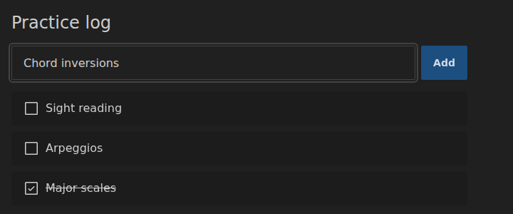

# Data-driven form processing

> Adapted for Reagent + re-frame from [Data-driven form processing](https://replicant.fun/tutorials/forms/)
> by Christian Johansen. The code for this tutorial is in [`code/forms`](../code/forms/).

Forms are where a lot of UI code gets messy. You need somewhere to keep what
the user typed, you probably want to validate it, then you do something with
it, and finally the form should be ready for the next round. This is the
first of three tutorials that handle forms with data instead of callbacks,
each one a step further up the ladder of abstraction:

1. **This tutorial:** an event handler on each individual field. Simple, very
   explicit, and fine for small forms.
2. [Data-driven first class forms](./first-class-forms.md): treat a form as
   one thing, read all its fields at once, validate and submit it as a whole.
3. [Declarative forms](./declarative-forms.md): describe a form's fields,
   validation rules and submit behavior entirely as data.

**A note on state.** The original tutorials keep their state in
[Datascript](https://github.com/tonsky/datascript), an in-memory database,
and change it by sending it transactions. This port uses re-frame's plain
app-db map instead. Most re-frame apps keep their state in a map, and the
techniques in these tutorials don't depend on Datascript: every idea carries
over, and where the map forces a different design, the text says so. (The
[Datascript state tutorial](./state-datascript.md) shows how to use Datascript
with re-frame, if you're curious.)

## A quick recap

If you have read the other tutorials in this repository, skip ahead.

- [Reagent](https://reagent-project.github.io/) renders
  [hiccup](../guides/data-driven-reagent.md#hiccup), HTML written as Clojure
  data like `[:h1 "Hi"]`, using React.
- [re-frame](https://day8.github.io/re-frame/) keeps all application state in
  one map called **app-db**. **Events**, vectors like `[:task/add {...}]`, are
  the only way to change it: you register an event handler, a pure function
  from the current app-db to the next one. **Subscriptions** read from app-db.
- The views in these tutorials are plain functions that take data and return
  hiccup. One Reagent component at the top subscribes to app-db and renders
  everything from it. When app-db changes, the whole page is rendered again
  from the top ([top-down rendering](../guides/data-driven-reagent.md#top-down-rendering-with-re-frame)).
- Event handlers in the views are data, not functions:
  `{:on {:click [:store/assoc-in [:menu :open?] true]}}`. The small
  `datadriven.hiccup` namespace turns this data into functions that dispatch
  re-frame events. See
  [Event handlers as data](../guides/data-driven-reagent.md#event-handlers-as-data).

## Setup

The starting point is in [`code/forms-setup`](../code/forms-setup/). Copy the
directory and start it:

```sh
cp -r code/forms-setup practice-log
cd practice-log
npm install
npx tailwindcss -i ./src/main.css -o ./resources/public/tailwind.css --watch
```

And in another terminal:

```sh
npx shadow-cljs watch app
```

[shadow-cljs](https://shadow-cljs.github.io/docs/UsersGuide.html) compiles
the ClojureScript, serves the app on http://localhost:8080 and reloads code
when you save a file. The first command runs
[Tailwind CSS](https://tailwindcss.com/) with the
[daisyUI](https://daisyui.com/) plugin, which generate the stylesheet from
the class names used in the source code (like `btn` and `input-bordered`). The
`Makefile` has both commands as `make tailwind` and `make shadow`. Tests run
with `clojure -M:dev -m kaocha.runner`.

The page just says "Practice log". Here is what's there:

- `src/toil/ui.cljc` renders the page. It's a `.cljc` file, which means it
  can be used from both ClojureScript (in the browser) and Clojure (on the
  JVM, where the tests run). That's possible because it only contains pure
  functions that return data.
- `src/toil/core.cljs` is the browser-only glue: re-frame events,
  subscriptions, and the Reagent root component.
- `src/datadriven/hiccup.cljc` is the bridge between data-driven hiccup and
  Reagent, copied from [`lib/`](../lib/src/datadriven/hiccup.cljc).
- `dev/toil/dev.cljs` starts the app in development. It logs every re-frame
  event to the browser console, and hands app-db to
  [Dataspex](https://github.com/cjohansen/dataspex), a data browser that lives
  in your browser's developer tools (install the Dataspex extension for Chrome
  or Firefox to use it).

`core.cljs` is short:

```clojure
;; src/toil/core.cljs
(ns toil.core
  (:require [datadriven.hiccup :as hiccup]
            [re-frame.core :as rf]
            [reagent.dom.client :as rdc]
            [toil.ui :as ui]))

;; Events: the only way app-db changes

(rf/reg-event-db :app/start
  (fn [db [_ now]]
    (assoc db :app/started-at now)))

(rf/reg-event-db :store/assoc-in
  (fn [db [_ path v]]
    (assoc-in db path v)))

;; Subscriptions: what the UI reads

(rf/reg-sub :app/db
  (fn [db _]
    db))

;; Rendering

(defn app []
  (hiccup/prepare (ui/render-page @(rf/subscribe [:app/db]))))

(defonce root
  (delay (rdc/create-root (js/document.getElementById "app"))))

(defn render []
  (rdc/render @root [app]))

(defn main []
  (rf/dispatch-sync [:app/start (js/Date.)])
  (render))
```

`:store/assoc-in` is a generic event: `[:store/assoc-in [:a :b] 42]` does
`(assoc-in db [:a :b] 42)`. The [state management
tutorial](./state-atom.md) explains why such a small tool covers so much.
The `:app/db` subscription hands the whole of app-db to the view. re-frame's
docs usually recommend narrower subscriptions, but rendering everything from
the whole state is the honest translation of the original, and keeps this
tutorial focused on forms. `hiccup/prepare` turns the data-driven hiccup into
something Reagent can render.

## The task

Yes, we're building a todo list. To make it a little less tired, we'll call
it a *practice log*: a list of things to practice, like "major scales". It
starts out with a form that has a single text field, and in the next
tutorial the tasks grow more details, like priority and duration.

In this tutorial we'll build the form for adding tasks, list the tasks, and
make it possible to tick them off.

## Rendering the form

First, a form on the screen. Replace `src/toil/ui.cljc` with this:

```clojure
;; src/toil/ui.cljc
(ns toil.ui)

(defn render-task-form [db]
  [:form.mb-4.flex.gap-2.max-w-screen-sm
   [:input.input.input-bordered.w-full
    {:type "text"
     :name "name"
     :placeholder "What will you practice?"}]
   [:button.btn.btn-primary "Add"]])

(defn render-page [db]
  [:main.md:p-8.p-4.max-w-screen-m
   [:h1.text-2xl.mb-4 "Practice log"]
   (render-task-form db)])
```

The classes after the tag name (`.input.input-bordered.w-full`) are daisyUI
and Tailwind classes. They make things look nice, and you can ignore them.

Next, we want to know what the user types. The DOM's
[input event](https://developer.mozilla.org/en-US/docs/Web/API/Element/input_event)
fires on every change to the field, so we can store the text in app-db
keystroke by keystroke:

```clojure
(defn render-task-form [db]
  [:form.mb-4.flex.gap-2.max-w-screen-sm
   [:input.input.input-bordered.w-full
    {:type "text"
     :name "name"
     :placeholder "What do you need to practice?"
     :on {:input [:store/assoc-in [:new-task :task/name] :event/target.value]}}]
   [:button.btn.btn-primary "Add"]])
```

`:event/target.value` is a
[placeholder](../guides/data-driven-reagent.md#placeholders). The view can't
know what the user is going to type, so it leaves this keyword where the text
should go. When the event fires, `datadriven.hiccup` replaces it with the
input field's current value and dispatches the result. The text ends up in
app-db under `[:new-task :task/name]`: a small map where we collect the task
being written, separate from the tasks we have already stored.

The original stores the text on a temporary Datascript entity with a
well-known name. With a map, a well-known key is all it takes.

Type something and look at the browser console, where the dev namespace logs
every event:

```
[:store/assoc-in [:new-task :task/name] "M"]
[:store/assoc-in [:new-task :task/name] "Ma"]
[:store/assoc-in [:new-task :task/name] "Maj"]
[:store/assoc-in [:new-task :task/name] "Majo"]
[:store/assoc-in [:new-task :task/name] "Major"]
[:store/assoc-in [:new-task :task/name] "Major "]
[:store/assoc-in [:new-task :task/name] "Major s"]
[:store/assoc-in [:new-task :task/name] "Major sc"]
[:store/assoc-in [:new-task :task/name] "Major sca"]
[:store/assoc-in [:new-task :task/name] "Major scal"]
[:store/assoc-in [:new-task :task/name] "Major scale"]
```

Every event changes app-db, and every change renders the page again. So the
view can now make decisions based on what the user has typed so far. A good
first use: keep the button disabled until there's some text to add.

```clojure
(defn render-task-form [db]
  (let [text (get-in db [:new-task :task/name])] ;; 1.
    [:form.mb-4.flex.gap-2.max-w-screen-sm
     [:input ,,,]
     [:button.btn.btn-primary
      (cond-> {}
        (empty? text) (assoc :disabled "disabled")) ;; 2.
      "Add"]]))
```

(`,,,` stands for code that hasn't changed and is left out. Commas are
whitespace in Clojure.)

1. Read the text from app-db. It's `nil` until the user has typed something.
2. Disable the button when there's no text. daisyUI styles disabled buttons,
   and the browser won't let anyone click them.

## Submitting the form

With some text in place, the user should be able to submit the form. We'll
listen for the form's
[submit event](https://developer.mozilla.org/en-US/docs/Web/API/HTMLFormElement/submit_event)
rather than a click on the button. That way, pressing Enter in the text field
works too, and so does every other way the browser has of submitting a form,
including those used by assistive technology. We get it for free by sticking
to what the browser already does.

There is a catch: when a form is submitted, the browser's default behavior is
to send an HTTP request. A form without an
[`action`](https://developer.mozilla.org/en-US/docs/Web/HTML/Element/form#action)
sends it to the current URL, which reloads the page. To stop that, the event
handler must call `.preventDefault` on the event object. We don't want to
write a function in the view just for that.

### Prevent default, the data-driven way

In the original, the central function that runs actions has the DOM event at
hand, so it gets a `:event/prevent-default` action. `datadriven.hiccup` has
the same action built in, with one important difference in how it runs.

re-frame's `dispatch` doesn't handle an event right away. It puts it in a
queue and handles it a moment later. By then, the browser has finished
dealing with the DOM event, and it's too late to prevent anything. So
`datadriven.hiccup` runs `[:event/prevent-default]` (and
`[:event/stop-propagation]`) on the spot, while the DOM event is still being
handled, and only dispatches the other actions to re-frame. Try it:

```clojure
(defn render-task-form [db]
  (let [text (get-in db [:new-task :task/name])]
    [:form.mb-4.flex.gap-2.max-w-screen-sm
     {:on {:submit [[:event/prevent-default]]}} ;; 1.
     [:input ,,,]
     [:button.btn.btn-primary
      (cond-> {:type "submit"}                  ;; 2.
        (empty? text) (assoc :disabled "disabled"))
      "Add"]]))
```

1. A vector of actions. For now there's only one.
2. A button with `type="submit"` submits its form when clicked.

Submitting the form now does nothing at all, and that's progress: the page no
longer reloads.

### Storing a new task

When the form is submitted, we want to store a new task. Before writing the
action, we need to decide where tasks live in app-db. Datascript gives every
entity an id, and lets you look entities up by id. A map can do the same if
we keep the tasks in a map keyed by id:

```clojure
{:tasks {1 {:task/id 1
            :task/name "Major scales"
            :task/created-at #inst "2026-03-08T09:48:14.781-00:00"}
         2 {:task/id 2
            :task/name "Arpeggios"
            :task/created-at #inst "2026-03-08T09:50:03.117-00:00"}}}
```

Then `[:tasks 2 :task/name]` is the path to a task's name, and
`:store/assoc-in` can change any part of any task. The
[state management tutorial](./state-atom.md) recommends this shape for the
same reason.

Where does a new task's id come from? Datascript picks one when you transact
a new entity. We'll make the choice in a pure function, in a new namespace
for task-related code:

```clojure
;; src/toil/task.cljc
(ns toil.task)

(defn add-task
  "Adds `task` to the db under the next free id."
  [db task]
  (let [id (inc (reduce max 0 (keys (:tasks db))))]
    (assoc-in db [:tasks id] (assoc task :task/id id))))
```

The view could compute the id itself, since it has all of app-db. But an
event handler is the better place: it always sees the very latest app-db,
while the view only knows the app-db of its last render. So `add-task`
becomes a re-frame event in `core.cljs`:

```clojure
;; src/toil/core.cljs
(ns toil.core
  (:require ,,,
            [toil.task :as task]
            ,,,))

,,,

(rf/reg-event-db :task/add
  (fn [db [_ task]]
    (task/add-task db task)))
```

The form can now store the task. Just like the button, it guards against
empty text:

```clojure
[:form.mb-4.flex.gap-2.max-w-screen-sm
 {:on {:submit [[:event/prevent-default]
                (when-not (empty? text)
                  [:task/add {:task/name text}])]}}
 ,,,]
```

`nil` actions are skipped, so `when` works nicely inside the vector.

We'd also like to know when each task was created, to list them in order.
But where would the time come from? The view is a pure function in a `.cljc`
file: it shouldn't call `(js/Date.)`, and if it did, it would get the time of
the render, not the time of the submit. The answer is another placeholder.
`datadriven.hiccup` comes with `:clock/now`, which becomes a `js/Date` when
the event fires (the original adds it to its own `interpolate` function at
this point):

```clojure
[:form.mb-4.flex.gap-2.max-w-screen-sm
 {:on {:submit [[:event/prevent-default]
                (when-not (empty? text)
                  [:task/add {:task/name text
                              :task/created-at :clock/now}])]}} ;; <=
 ,,,]
```

Submit the form and the console confirms it:

```
[:task/add {:task/name "Major scales", :task/created-at #inst "2026-03-08T09:48:14.781-00:00"}]
```

With the Dataspex extension installed, you can also find the new task in
app-db in the developer tools. The rest of us would like to see it on the
page.

## Rendering tasks

To list the tasks, we need them in a sensible order. `get-tasks` goes in the
task namespace, and puts the newest task first, so that new tasks show up
right below the form:

```clojure
;; src/toil/task.cljc
(defn get-tasks
  "Returns all tasks, newest first, or nil when there are none."
  [db]
  (->> (vals (:tasks db))
       (sort-by :task/created-at #(compare %2 %1))
       seq))
```

`compare` works on dates both in ClojureScript and on the JVM, which keeps
the function testable with plain Clojure tests.

For a little decoration, we use icons from
[Phosphor](https://phosphoricons.com/) through
[phosphor-clj](https://github.com/cjohansen/phosphor-clj), which is already
in `deps.edn`. `(icons/icon :phosphor.regular/square)` includes the icon in
the build, and `icons/render` returns it as hiccup:

```clojure
;; src/toil/ui.cljc
(ns toil.ui
  (:require [phosphor.icons :as icons]
            [toil.task :as task]))

,,,

(defn render-task [task]
  [:div.flex.place-content-between
   [:button.cursor-pointer.flex.items-center
    [:span.w-8.pr-2
     (icons/render (icons/icon :phosphor.regular/square)
                   {:focusable "false"})]
    (:task/name task)]])

(defn render-tasks [db]
  [:ol.mb-4.max-w-screen-sm
   (for [task (task/get-tasks db)]
     [:li.bg-base-200.my-2.px-4.py-3.rounded.w-full
      (render-task task)])])

(defn render-page [db]
  [:main.md:p-8.p-4.max-w-screen-m
   [:h1.text-2xl.mb-4 "Practice log"]
   (render-task-form db)
   (render-tasks db)])
```

Each task is a button, because we want to click it to mark the task as
complete. Here's the full version, with some extra flair:

```clojure
(defn render-task [task]
  [:div.flex.place-content-between
   [:button.cursor-pointer.flex.items-center
    {:aria-label (if (:task/complete? task)
                   "Click to un-complete"
                   "Click to complete")
     :on {:click [:store/assoc-in [:tasks (:task/id task) :task/complete?]
                  (not (:task/complete? task))]}}                ;; 1.
    (if (:task/complete? task)                                    ;; 2.
      [:span.w-8.pr-2.tilt.transition.duration-1000.flash-success ;; 3.
       {:key "done"}                                              ;; 4.
       (icons/render (icons/icon :phosphor.regular/check-square)
                     {:focusable "false"})]
      [:span.w-8.pr-2
       {:key "todo"}
       (icons/render (icons/icon :phosphor.regular/square)
                     {:focusable "false"})])
    [:span {:class (when (:task/complete? task)
                     "line-through")}
     (:task/name task)]]])

(defn render-tasks [db]
  [:ol.mb-4.max-w-screen-sm
   (for [task (task/get-tasks db)]
     [:li.bg-base-200.my-2.px-4.py-3.rounded.w-full
      {:key (:task/id task)}                                      ;; 5.
      (render-task task)])])
```

1. A click flips the task's complete state. Thanks to the tasks being keyed
   by id, this is a plain `:store/assoc-in`. The view computes the new value,
   `(not (:task/complete? task))`, when it renders.
2. Completed tasks get a different icon.
3. `tilt` is a CSS animation (in `src/main.css`) that makes the icon wiggle
   when it appears. `transition` and `duration-1000` make changes to the
   icon's color fade over one second. `flash-success` is explained below.
4. The two icons have different keys. When a task is completed, React sees
   an element with a new key and creates a fresh one instead of updating the
   old one. That's what makes the wiggle animation play every time. The
   original uses `:replicant/key` for this; React calls it `:key`.
5. Each task's list item has the task's id as its key. New tasks are added at
   the top of the list, which moves every other task one position down.
   Without keys, React matches old and new list items by position, would
   end up building a fresh check icon for a completed task, and it would
   wiggle again. See [Keys](../guides/data-driven-reagent.md#keys).

The original also flashes the check icon green when it appears, by giving it
the `text-success` class only while it's being mounted
(`:replicant/mounting`). React has no such feature, but CSS does:
[`@starting-style`](https://developer.mozilla.org/en-US/docs/Web/CSS/@starting-style)
gives an element the style it starts from when it first appears, and a
transition then takes it to its normal style. Add this to `src/main.css`:

```css
/* Newly mounted .flash-success elements start out in the success color and
   fade to the normal text color (the `transition` class does the fading). */
@starting-style {
    .flash-success {
        color: var(--fallback-su, oklch(var(--su)));
    }
}
```

`--su` is the variable where daisyUI keeps its success color. Newer versions
of Tailwind have a `starting:` variant for this, but this project uses
Tailwind 3, like the original.

## Cleaning up

With the tasks on the screen, it's easy to spot what's still missing. When
you add a task, it shows up in the list, but its name is still in the text
field, ready to be added again.

Since every keystroke is stored in app-db, we can take charge of the field's
content: give the input a `:value`, and it will always show what app-db
says. This is called a *controlled* input.

```clojure
(defn render-task-form [db]
  (let [text (get-in db [:new-task :task/name])]
    [:form.mb-4.flex.gap-2.max-w-screen-sm
     ,,,
     [:input.input.input-bordered.w-full
      {:type "text"
       :name "name"
       :value text ;; <=
       :placeholder "What do you need to practice?"
       :on {:input [:store/assoc-in [:new-task :task/name] :event/target.value]}}]
     ,,,]))
```

Now clearing the field is a matter of clearing the text in app-db when the
task is added:

```clojure
(defn render-task-form [db]
  (let [text (get-in db [:new-task :task/name])]
    [:form.mb-4.flex.gap-2.max-w-screen-sm
     {:on {:submit [[:event/prevent-default]
                    (when-not (empty? text)
                      [:task/add {:task/name text
                                  :task/created-at :clock/now}])
                    (when-not (empty? text)
                      [:store/assoc-in [:new-task :task/name] ""])]}} ;; <=
     [:input.input.input-bordered.w-full
      {:type "text"
       :name "name"
       :value text
       :placeholder "What do you need to practice?"
       :on {:input [:store/assoc-in [:new-task :task/name] :event/target.value]}}]
     [:button.btn.btn-primary
      (cond-> {:type "submit"}
        (empty? text) (assoc :disabled "disabled"))
      "Add"]]))
```

That's it: the form now clears after each new task.

### Controlled inputs and asynchronous events

Controlled inputs deserve a closer look, because this is where React and
re-frame behave differently from Replicant.

Replicant runs the actions and renders the page again right away, while the
browser is still handling the keystroke, so the field and app-db never
disagree. re-frame and Reagent normally take their time: `rf/dispatch` puts
the event in a queue that re-frame works through shortly after, and Reagent
re-renders on the browser's next animation frame. Meanwhile, React insists
that a controlled input shows its `:value`. If the field is rendered before
the keystroke has reached app-db, React puts the old text back. Typing fast
then loses characters, and typing in the middle of the text makes the cursor
jump to the end.

`datadriven.hiccup` takes care of this for you, in two ways:

- Actions for `:input` and `:change` events are dispatched with
  `rf/dispatch-sync`, which handles the event immediately instead of
  queueing it. re-frame's own documentation names "the `:on-change` handler
  of a text field where we are expecting fast typing" as one of the few good
  reasons to use it. Other events, like clicks and submits, still go through
  the queue.
- On form fields, `:on {:input ...}` becomes React's `:on-change`, not
  `:on-input`. In the DOM, a text field's `change` event only fires when you
  leave the field, but React's `onChange` fires on every keystroke, just like
  `input`. It's also what Reagent's safety net for controlled inputs is built
  around: it keeps the text and the cursor in place, and turns a `nil` value
  into an empty string.
- After those synchronous events, it calls Reagent's `r/flush`, which renders
  right away instead of on the next animation frame. Otherwise app-db would
  be up to date, but the page could still be one keystroke behind. That
  matters here: the form's submit handler holds the `text` from the last
  render, and pressing Enter right after typing could add the task without
  its last letter.

So the view can stay exactly as the original writes it, and the event handler
remains plain data. If you write your own event handlers in Reagent (as
functions), remember the combination: `:on-change` plus `rf/dispatch-sync`
for controlled text fields. Together, these three tricks give the input
events Replicant's behavior: state changes and rendering happen before the
browser moves on.



## Testing

Everything in `ui.cljc` and `task.cljc` is a pure function, so testing is a
matter of comparing data. The event handlers in the views are data too, so we
can check what a form will do without a browser:

```clojure
;; test/toil/ui_test.cljc
(ns toil.ui-test
  (:require [clojure.test :refer [deftest is testing]]
            [toil.ui :as ui]))

(defn attrs [hiccup]
  (second hiccup))

(deftest render-task-form-test
  ,,,

  (testing "Adds the task and clears the field on submit"
    (is (= (-> (ui/render-task-form {:new-task {:task/name "Scales"}})
               attrs :on :submit)
           [[:event/prevent-default]
            [:task/add {:task/name "Scales"
                        :task/created-at :clock/now}]
            [:store/assoc-in [:new-task :task/name] ""]]))))
```

The project has tests for `add-task`, `get-tasks` and the views in `test/`.
Run them with `clojure -M:dev -m kaocha.runner`.

## Wrapping up

We built a form by handling every keystroke of its only field. This gives
you full control over the form at every moment, at the cost of some
bookkeeping per field. That gets old quickly on bigger forms. In
[the next tutorial](./first-class-forms.md), we'll treat forms as a whole
instead.

## What's different from the Replicant version

- **app-db instead of Datascript.** Tasks live in a map keyed by id under
  `:tasks`, and the text being typed lives under `:new-task`. The original
  transacts to Datascript with a generic `:db/transact` action; here, small
  generic events (`:store/assoc-in`) and one domain event (`:task/add`)
  change app-db.
- **New task ids** are assigned by the `:task/add` event, where Datascript
  would assign an entity id.
- **`:event/prevent-default` and `:clock/now`** are built into
  `datadriven.hiccup`, so there's no central `execute-actions` or
  `interpolate` function to extend. `:event/prevent-default` runs
  immediately, because re-frame handles dispatched events later.
- **`:replicant/key` is `:key`**, and the list items have keys too, since new
  tasks are inserted at the top.
- **`:replicant/mounting`** is replaced by CSS `@starting-style`.
- **Controlled inputs** need synchronous event handling in re-frame.
  `datadriven.hiccup` dispatches `:input` and `:change` actions with
  `rf/dispatch-sync`, as re-frame's docs recommend, renders right away with
  `r/flush`, and turns `:input` on form fields into React's `:on-change`.
- The `aria-label`s on the task buttons are the right way around (the
  original has them swapped).
- The code has tests, and uses Tailwind 3 and daisyUI 4 like the original
  (Tailwind 4 and daisyUI 5 changed the configuration format and some class
  names).
