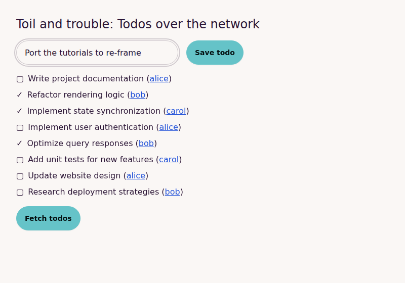

# Data-driven commands

> Adapted for Reagent + re-frame from [Data-driven commands](https://replicant.fun/tutorials/network-writes/)
> by Christian Johansen. The code for this tutorial is in [`code/network-writes`](../code/network-writes/).

This is the third and last part of the [networking tutorial](./network.md).
In [the second part](./network-reads.md) we built a data-driven system for
reading data over the network. Now we'll build its sibling, for writing data.



## A quick recap

If you haven't read the other tutorials, here is what you need to know:

- [Reagent](https://reagent-project.github.io/) renders
  [hiccup](../guides/data-driven-reagent.md#hiccup), HTML written as Clojure
  data, with React. [re-frame](https://day8.github.io/re-frame/) keeps all
  application state in a single atom called **app-db**, which only changes
  when an **event** is dispatched and its **event handler** returns a new
  state. Handlers are pure; side effects such as HTTP requests are described
  as **effects** and carried out by functions registered with `reg-fx`.
- There is one Reagent component, `app`, at the top, which passes all of
  app-db to plain functions that return hiccup. See
  [top-down rendering](../guides/data-driven-reagent.md#top-down-rendering-with-re-frame).
- Event handlers in the views are data, like `{:on {:click [[:data/query ,,,]]}}`.
  `datadriven.hiccup/prepare` dispatches each action in the vector as a
  re-frame event. See
  [Event handlers as data](../guides/data-driven-reagent.md#event-handlers-as-data).
- From [part two](./network-reads.md): a **query** is a map like
  `{:query/kind :query/todo-items}`. Dispatching `[:data/query query]` sends it
  to the backend and records the request and its response in a log in app-db.
  Views ask that log questions with `toil.query/loading?`,
  `toil.query/get-result` and friends. Each page in the app is a map with a
  route, a render function and `:on-load` actions that run when the user
  arrives at the page.

(`,,,` marks code left out, here and in the rest of the tutorial.)

## Setup

We continue where part two left off. Copy
[`code/network-reads`](../code/network-reads/) to a new directory, run
`npm install`, and start shadow-cljs, Tailwind and the backend as described in
[the setup section of part one](./network.md#the-setup) (or in the project's
README). Then open [http://localhost:8088](http://localhost:8088).

The backend in the finished project also has a `/command` endpoint, which we
use below. If you're typing along, copy `src/toil/server.clj` from
[`code/network-writes`](../code/network-writes/src/toil/server.clj) and
restart the backend.

## Design goal

Writing over the network looks a lot like reading, and we'll follow a very
similar design. We do want writes to be a bit more focused, though.

We already have a way to read data, and we don't want writes to become a
second one. So a write only reports whether it succeeded or failed, plus maybe
something new that only the backend knows, like the id of a created entity.
It does not send back the entities it changed. Instead, we'll make it easy to
read fresh data after a write succeeds.

Reads are called queries; we'll call writes **commands**. Like queries, they
are maps in the frontend. Whether your backend understands these maps
directly or you translate them to REST calls or something else is up to you
(see [part two](./network-reads.md#what-if-the-backend-cant-be-tailored-to-the-frontend)).

```clojure
{:command/kind :command/create-todo
 :command/data {:todo/title "Implement commands"}}
```

## Answering questions

As with queries, we keep a log per command, and write pure functions that
answer questions about it. The functions mirror the ones in `toil.query`,
with the statuses `issued`, `success` and `error`:

```clojure
;; src/toil/command.cljc
(ns toil.command)

(defn add-log-entry [log entry]
  (cons entry log))

(defn issue-command [state now command]
  (update-in state [::log command] add-log-entry
             {:command/status :command.status/issued
              :command/user-time now}))

(defn receive-response [state now command response]
  (update-in state [::log command] add-log-entry
             (cond-> {:command/status (if (:success? response)
                                        :command.status/success
                                        :command.status/error)
                      :command/user-time now}
               (:result response)
               (assoc :command/result (:result response)))))

,,,

(defn issued? [state command]
  (= :command.status/issued
     (get-latest-status state command)))

,,,
```

The rest (`get-log`, `get-latest-status`, `success?`, `error?` and
`issued-at`) is in [the finished code](../code/network-writes/src/toil/command.cljc),
along with [the tests](../code/network-writes/test/toil/command_test.cljc).
This one sums it up: once the response is in, the command is no longer
waiting to complete:

```clojure
;; test/toil/command_test.cljc
(testing "Received successful response"
  (is (false? (-> (command/issue-command {} #inst "2025-01-02T06:44:13" command)
                  (command/receive-response #inst "2025-01-02T06:44:14" command
                    {:success? true})
                  (command/issued? command)))))
```

## Making HTTP requests

The backend has a `/command` endpoint that accepts command maps, just like
`/query` accepts queries. We can reuse the `:backend/request` effect from
part two as it is: it POSTs EDN to a URL and dispatches an event with the
answer. What we need are two new events, which look almost exactly like the
query ones:

```clojure
;; src/toil/core.cljs
(ns toil.core
  (:require ,,,
            [toil.command :as command]
            ,,,))

,,,

(rf/reg-event-fx :data/command
  [(rf/inject-cofx :now)]
  (fn [{:keys [db now]} [_ command]]
    {:db (command/issue-command db now command)
     :fx [[:backend/request
           {:url "/command"
            :body command
            :on-response [:data/receive-command-response command]}]]}))

(rf/reg-event-fx :data/receive-command-response
  [(rf/inject-cofx :now)]
  (fn [{:keys [db now]} [_ command response]]
    {:db (command/receive-response db now command response)}))
```

This lets us issue commands. But since writes don't return data, we need a
way to refresh the data after a command succeeds. We'll let a command action
carry a list of actions to run when it succeeds:

```clojure
[[:data/command
  {:command/kind :command/toggle-todo
   :command/data {:todo/id "ac564c"}}
  {:on-success [[:data/query items-query]]}]]
```

The Replicant version has to do some juggling here: `issue-command` calls
`execute-actions`, which in turn calls `issue-command`, so one of them must be
`declare`d first. In re-frame, actions are events, and an event handler can
ask for more events with the `:dispatch` effect. So we pass the options along
to the response event, and it dispatches the `:on-success` actions if the
backend reports success:

```clojure
;; src/toil/core.cljs
;; `opts` may contain :on-success, a vector of actions to dispatch when the
;; backend reports that the command succeeded.
(rf/reg-event-fx :data/command
  [(rf/inject-cofx :now)]
  (fn [{:keys [db now]} [_ command opts]]
    {:db (command/issue-command db now command)
     :fx [[:backend/request
           {:url "/command"
            :body command
            :on-response [:data/receive-command-response command opts]}]]}))

(rf/reg-event-fx :data/receive-command-response
  [(rf/inject-cofx :now)]
  (fn [{:keys [db now]} [_ command {:keys [on-success]} response]]
    (cond-> {:db (command/receive-response db now command response)}
      (:success? response)
      (assoc :fx (mapv (fn [action] [:dispatch action]) on-success)))))
```

Both handlers are still pure functions from data to data. The only code that
touches the network is the `:backend/request` effect we already had.

This is also how you'd do it with
[re-frame-http-fx](https://github.com/day8/re-frame-http-fx), except that
there, each request names its own `:on-success` event. Here the success
actions are chosen by the *view*, as data, so a new command with different
follow-ups needs no new event handler.

## Issuing commands

With the `:data/command` action in place, we can make the todo items on the
frontpage togglable:

```clojure
;; src/toil/frontpage.cljc
(ns toil.frontpage
  (:require [toil.command :as command]
            [toil.query :as query]))

(def items-query
  {:query/kind :query/todo-items})

(defn render [state]
  [:main.p-8.max-w-screen-lg
   [:h1.text-2xl.mb-4 "Toil and trouble: Todos over the network"]
   (when-let [todos (query/get-result state items-query)]
     [:ul.mb-4
      (for [item todos]
        (let [command {:command/kind :command/toggle-todo
                       :command/data item}]
          [:li.my-2
           [:button.cursor-pointer
            (if (command/issued? state command)
              {:disabled true}
              {:on {:click
                    [[:data/command command
                      {:on-success [[:data/query items-query]]}]]}})
            [:span.pr-2
             (if (:todo/done? item)
               "✓"
               "▢")]]
           (:todo/title item)
           " ("
           [:ui/a.link
            {:ui/location
             {:location/page-id :pages/user
              :location/params {:user/id (:todo/created-by item)}}}
            (:todo/created-by item)]
           ")"]))])
   (if (query/loading? state items-query)
     [:button.btn.btn-primary {:disabled true}
      [:span.loading.loading-spinner]
      "Fetching todos"]
     [:button.btn.btn-primary
      {:on {:click [[:data/query items-query]]}}
      "Fetch todos"])])
```

Click the box or check mark next to an item to toggle it. While the command is
on its way, `command/issued?` is true and the button is disabled, so a double
click can't send it twice. When the backend confirms, the todo items are
fetched again and the list updates.

As with queries, we can now add new commands to the frontend without any new
imperative code: a backend handler, and a view that uses a new command map.

## Issuing commands with user input

As a last feature, let's add a text field for creating new todos. The text
has to go from the input into a command. We already have what we need for
that: the `:store/assoc-in` event, and the `:event/target.value`
[placeholder](../guides/data-driven-reagent.md#placeholders), which
`datadriven.hiccup` replaces with the input's value when the event fires.

First, the form:

```clojure
[:form.flex.gap-4.mb-4
 [:input.input.input-bordered.w-full.max-w-xs
  {:type "text"
   :placeholder "New todo"}]
 [:button.btn.btn-primary {:type "submit"}
  "Save todo"]]
```

Then we store the text in app-db as the user types:

```clojure
[:input.input.input-bordered.w-full.max-w-xs
 {:type "text"
  :placeholder "New todo"
  :value (or (::todo-title state) "")
  :on {:change [[:store/assoc-in [::todo-title] :event/target.value]]}}]
```

Two details here differ from the Replicant version, both because of React:

- **The event is `:change`, not `:input`.** React's `onChange` fires on every
  keystroke, just like the DOM's `input` event. When an input has a `:value`
  and an `:on-change` handler, Reagent keeps the text field in sync with
  app-db even though re-frame updates app-db a moment *after* the keystroke.
  With `:on-input`, React resets the field to the old value after every
  keystroke, and the cursor jumps to the end whenever you type in the middle
  of the text. (Reagent's workaround isn't perfect either: extremely fast
  input, like a test robot typing a character every few milliseconds, can
  still lose characters. Human typing is fine.)
- **The value is never `nil`.** `(::todo-title state)` is `nil` until the
  user types. In React, an input with a `nil` value is *uncontrolled* (React
  leaves its content alone), and React warns when it later gets a real value
  and becomes controlled. Reagent's input wrapper happens to smooth this over
  for inputs with `:on-change`, but `(or ,,, "")` makes the intent explicit.

Next we need to issue a command with the title. A first version could put a
click handler on the button. It's only there when there is a title, and on
success it clears the field and fetches the todo items again:

```clojure
;; src/toil/frontpage.cljc (intermediate version)
[:button.btn.btn-primary
 {:type "button"
  :on
  (when-let [title (not-empty (::todo-title state))]
    {:click [[:data/command
              {:command/kind :command/create-todo
               :command/data {:todo/created-by "alice"
                              :todo/title title}}
              {:on-success [[:store/assoc-in [::todo-title] ""]
                            [:data/query items-query]]}]]})}
 "Save todo"]
```

This works when you click, but pressing Enter in the text field submits the
form, which makes the browser reload the page. The Replicant tutorial points
out that a proper `submit` handler would be better, but that it needs extra
work to call `.preventDefault` on the event. `datadriven.hiccup` has that
built in: `[:event/prevent-default]` runs right away on the DOM event, before
the rest of the actions are dispatched. So we can go straight to the better
version, with a submit button and the handler on the form:

```clojure
;; src/toil/frontpage.cljc
(defn render [state]
  [:main.p-8.max-w-screen-lg
   [:h1.text-2xl.mb-4 "Toil and trouble: Todos over the network"]
   [:form.flex.gap-4.mb-4
    {:on {:submit
          [[:event/prevent-default]
           (when-let [title (not-empty (::todo-title state))]
             [:data/command
              {:command/kind :command/create-todo
               :command/data {:todo/created-by "alice"
                              :todo/title title}}
              {:on-success [[:store/assoc-in [::todo-title] ""]
                            [:data/query items-query]]}])]}}
    [:input.input.input-bordered.w-full.max-w-xs
     {:type "text"
      :placeholder "New todo"
      :value (or (::todo-title state) "")
      :on {:change [[:store/assoc-in [::todo-title] :event/target.value]]}}]
    [:button.btn.btn-primary {:type "submit"}
     "Save todo"]]
   ,,,])
```

`nil` actions are skipped, so with an empty title, submitting only prevents
the page reload. Both clicking the button and pressing Enter now save the
todo.

You could also skip `::todo-title` in app-db and read the text from the form
when it's submitted, by registering a placeholder of your own with
`hiccup/register-placeholder!`. The [forms tutorials](./forms.md) take that
route.

The complete code is in [`code/network-writes`](../code/network-writes/).

## What's different from the Replicant version

- **No `declare` needed.** The original's `issue-command` calls
  `execute-actions` for the success actions. Here the response event
  dispatches them with `:fx [[:dispatch ,,,]]`, and the command is split into
  an event (`:data/command`), a response event and the shared
  `:backend/request` effect.
- **Success actions run only on success.** The original runs `:on-success`
  whenever a response arrives, even `{:success? false}`. This version checks
  `:success?` first.
- **The form uses `:submit` and `[:event/prevent-default]`**, the "better
  version" the original suggests, so Enter works and doesn't reload the page.
- **The text field uses `:change` instead of `:input`, and its value is
  never `nil`**, to fit how React handles controlled inputs.
- **The backend's `toggle-todo` keeps the todos in a vector** (`mapv` instead
  of `for`), so new todos are always added at the end of the list. In the
  original, toggling turns the vector into a list, and later todos are added
  at the front.
- **Aliases take classes through `:class`**, and the backend reads commands
  with `clojure.edn/read-string`, as in the earlier parts.
