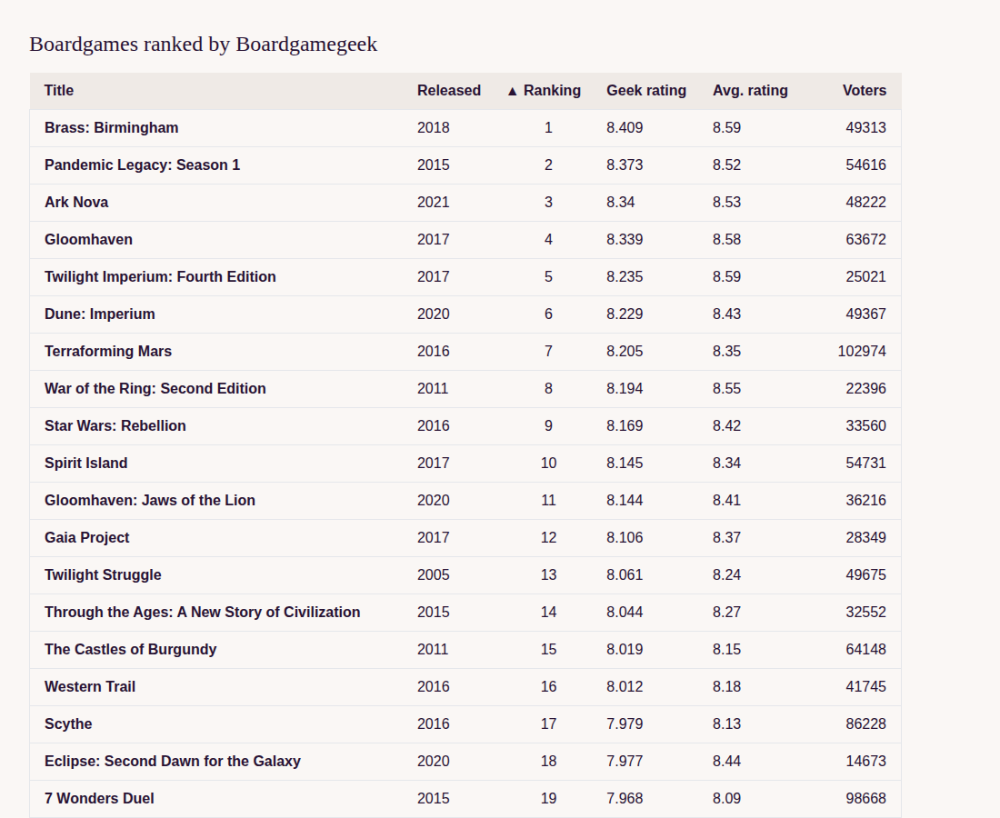

# A sortable table alias

> Adapted for Reagent + re-frame from [A sortable table alias](https://replicant.fun/tutorials/sortable-table/)
> by Christian Johansen. The code for this tutorial is in [`code/sortable-table`](../code/sortable-table/).

In this tutorial we build a table that can be sorted by clicking its column
headers, and then pull the sorting out into a reusable, data-driven set of
*aliases*. The goal is an abstraction that takes care of getting a dataset
into a table and sorting it, while leaving you free to format and style the
table however you want.



## Background

If this is the first tutorial you read, here's the short version of the
approach. The app uses [Reagent](https://reagent-project.github.io/), which
renders [hiccup](../guides/data-driven-reagent.md#hiccup) (HTML written as
Clojure vectors, like `[:h1 "Hi"]`) using React, and
[re-frame](https://day8.github.io/re-frame/), which keeps all application
state in one map called *app-db*. app-db only changes through *events*, and
side effects (like changing the URL) are described as data and carried out
by *effect handlers*. The whole UI is one pure function of app-db. Views
never dispatch or subscribe themselves: their event handlers are data, like
`{:on {:click [:router/navigate location]}}`, and a small function,
`datadriven.hiccup/prepare`, turns that data into real functions right before
Reagent renders. The [guide](../guides/data-driven-reagent.md) explains the
approach.

`prepare` also expands *aliases*: hiccup tags you define yourself. An alias is
a namespaced keyword with a function registered for it. When `prepare` meets
`[:my.app/thing attrs & children]`, it calls the function with the attribute
map and the children, and uses the hiccup it returns instead. See the
[guide](../guides/data-driven-reagent.md#aliases), or
[Tic-Tac-Toe with aliases](./tic-tac-toe-alias.md) for a gentler
introduction.

## Setup

The starting point is a stripped-down version of the router from the
[routing tutorial](./routing.md), which only deals with query and hash
parameters. It's styled with [Tailwind CSS](https://tailwindcss.com) and
[daisyUI](https://daisyui.com). Copy
[`code/sortable-table-setup`](../code/sortable-table-setup/) to a new
directory. Then, in one terminal, install the dependencies and start Tailwind,
which watches the source code for class names and writes
`resources/public/tailwind.css`:

```sh
npm install
npm run tailwind
```

In another terminal, start shadow-cljs (the ClojureScript build tool):

```sh
npx shadow-cljs watch app
```

Open http://localhost:8080/, and start a REPL if you like. Tests run with
`clojure -M:dev -m kaocha.runner`. The dev namespace also registers app-db
with [Dataspex](https://github.com/cjohansen/dataspex), so if you install its
browser extension, you can watch app-db (including the current location)
from the browser's developer tools.

Here's what the setup contains.

**The router**, `src/boardgames/router.cljc`, turns URLs into *location*
maps and back, using [lambdaisland/uri](https://github.com/lambdaisland/uri).
The hash part of the URL is parsed like a query string, and ends up as
`:location/hash-params`:

```clojure
(router/url->location "/#sort-column=title&sort-order=desc")
;;=> {:location/path "/"
;;    :location/hash-params {:sort-column "title", :sort-order "desc"}}
```

**The link alias.** The router namespace also registers a `:ui/a` alias. It
renders a link to a location, and when it's clicked, dispatches
`[:router/navigate location]` instead of letting the browser load a new page:

```clojure
;; src/boardgames/router.cljc
(defn routing-anchor
  "The `:ui/a` alias: a link to the location in `:ui/location`. Clicking it
  dispatches `[:router/navigate location]` instead of loading a new page."
  [attrs children]
  (let [location (:ui/location attrs)]
    (into [:a (cond-> attrs
                location
                (-> (assoc :href (location->url location))
                    (assoc-in [:on :click] [[:event/prevent-default]
                                            [:router/navigate location]])))]
          children)))

(hiccup/register-alias! :ui/a routing-anchor)
```

The click handler is a list of two actions. `[:event/prevent-default]` is
handled by `prepare`'s event code and stops the browser from following the
link. The second is dispatched to re-frame as an event.

**Events and effects**, in `src/boardgames/core.cljs`. `:router/navigate`
stores the new location in app-db and asks for the URL to be updated. If only
the hash params changed, it *replaces* the current history entry instead of
adding one, so that re-sorting the table doesn't fill up the back button's
history. The browser's history API is a side effect, so it lives in two
effect handlers:

```clojure
;; src/boardgames/core.cljs
(rf/reg-fx :history/push-state
  (fn [url]
    (.pushState js/history nil "" url)))

(rf/reg-fx :history/replace-state
  (fn [url]
    (.replaceState js/history nil "" url)))

(rf/reg-event-fx :router/navigate
  (fn [{:keys [db]} [_ location]]
    {:db (assoc db :location location)
     ;; Changes to the hash params only should not add a history entry
     :fx [[(if (router/essentially-same? location (:location db))
             :history/replace-state
             :history/push-state)
           (router/location->url location)]]}))
```

A `popstate` listener handles the back and forward buttons by dispatching
`[:router/location-changed location]`.

**Rendering.** app-db holds the data and the current location. The `app`
component subscribes to app-db and passes both to `ui/render-page`:

```clojure
;; src/boardgames/core.cljs
(defn app []
  (let [state @(rf/subscribe [:app/state])]
    (hiccup/prepare (ui/render-page state (:location state)))))
```

## A basic table

We'll start by showing our data in a plain table. The data is the
[40 top-ranked boardgames on boardgamegeek.com](https://boardgamegeek.com/browse/boardgame),
in `boardgames.data`:

```clojure
;; src/boardgames/data.cljc
(ns boardgames.data)

(def data
  {:boardgames
   [{:bgg/ranking 1
     :bgg/thumbnail "https://cf.geekdo-images.com/x3zxjr-Vw5iU4yDPg70Jgw__micro/img/4Od3GYCiqptga0VbmyumPbJlBsU=/fit-in/64x64/filters:strip_icc()/pic3490053.jpg"
     :boardgame/title "Brass: Birmingham"
     :boardgame/release-year 2018
     :bgg/geek-rating 8.409
     :bgg/average-rating 8.59
     :bgg/num-voters 49313}

    ,,,]})
```

(`,,,` stands for code left out of a listing. Clojure treats commas as
whitespace.)

As in the routing tutorial, the dev namespace hands this map to the app at
startup, where it becomes app-db, and `render-page` receives it as its first
argument. The UI doesn't know or care where the data comes from. Later it
could come from a server, and the UI wouldn't change.

Here's a basic table with some Tailwind classes:

```clojure
;; src/boardgames/ui.cljc
(ns boardgames.ui)

(defn render-page [{:keys [boardgames]} location]
  [:div.p-8.max-w-screen-lg
   [:h1.text-2xl.font-serif.mb-4 "Boardgames ranked by Boardgamegeek"]
   [:table.w-full
    [:thead
     [:tr.border-b.border-gray-200.bg-base-200
      [:th.py-2.text-left.px-4 "Title"]
      [:th.py-2.text-left.pr-4 "Released"]
      [:th.py-2.text-left.pr-4 "Ranking"]
      [:th.py-2.whitespace-nowrap.text-left.pr-4 "Geek rating"]
      [:th.py-2.whitespace-nowrap.text-left.pr-4 "Avg. rating"]
      [:th.py-2.text-right.px-4 "Voters"]]]
    [:tbody
     (for [game boardgames]
       [:tr.border-b.border-1.border-gray-200 {:key (:bgg/ranking game)}
        [:th.py-2.px-4.text-left (:boardgame/title game)]
        [:td.py-2.pr-4.text-left (:boardgame/release-year game)]
        [:td.py-2.pr-4.text-center (:bgg/ranking game)]
        [:td.py-2.pr-4.text-left (:bgg/geek-rating game)]
        [:td.py-2.pr-4.text-left (:bgg/average-rating game)]
        [:td.py-2.px-4.text-right (:bgg/num-voters game)]])]]])
```

Most of what this table will do is put the same rows in a different order.
Each row gets a [key](../guides/data-driven-reagent.md#keys), so React can
tell the rows apart and move the existing DOM elements around, instead of
rewriting the contents of every row.

## Indicating sorting column

Next, let's show which column the table is sorted by, with an arrow in its
header:

```clojure
[:th.py-2.text-left.pr-4 "▼ Ranking"]
```

The data happens to be sorted by ranking already, but we can make that
explicit:

```clojure
(for [game (sort-by :bgg/ranking compare boardgames)]
  [:tr.border-b.border-1.border-gray-200 {:key (:bgg/ranking game)}
   ,,,])
```

Clicking the header of the column we sort by should flip the order. We'll
keep the order in a hash parameter called `sort-order`, and read it before
sorting. This function finds the order in the location, and falls back to
ascending when the parameter is missing or has any value other than
`"desc"`:

```clojure
;; src/boardgames/ui.cljc
(defn get-sort-order [location]
  (if (= "desc" (-> location :location/hash-params :sort-order))
    "desc"
    "asc"))
```

A map from order to comparison function makes it easy to sort either way:

```clojure
;; src/boardgames/ui.cljc
(def comparators
  {"asc" compare
   "desc" #(compare %2 %1)})
```

`compare` works for numbers and strings alike, which we'll need once the
table can be sorted by title. (The original uses `<` and `>`. In the browser
they happen to compare strings too, but on the JVM they only accept numbers,
and we want our UI code to run in tests on the JVM.)

Now `render-page` can use them:

```clojure
;; src/boardgames/ui.cljc
(defn render-page [{:keys [boardgames]} location]
  (let [sort-order (get-sort-order location)]
    [:div.p-8.max-w-screen-lg
     ,,,
     [:table.w-full
      [:thead
       [:tr.border-b.border-gray-200.bg-base-200
        ,,,
        [:th.py-2.text-left.pr-4
         (if (= "desc" sort-order) "▼" "▲") " Ranking"]
        ,,,]]
      [:tbody
       (for [game (sort-by :bgg/ranking (comparators sort-order) boardgames)]
         [:tr.border-b.border-1.border-gray-200 {:key (:bgg/ranking game)}
          ,,,])]]]))
```

If you did everything right, nothing has changed. Progress! To make the header
clickable, first add another small map:

```clojure
;; src/boardgames/ui.cljc
(def reverse-order
  {"desc" "asc"
   "asc" "desc"})
```

Then make the header text a link, with the `:ui/a` alias, to the same location
with the opposite order:

```clojure
[:th.py-2.text-left.pr-4
 [:ui/a {:class "hover:underline cursor-pointer"
         :ui/location (assoc-in location [:location/hash-params :sort-order]
                                (reverse-order sort-order))}
  (if (= "desc" sort-order) "▼" "▲") " Ranking"]]
```

Click it, and the URL changes to `/#sort-order=desc`, the arrow flips, and
the table is sorted the other way. Click again to flip it back. Here's what
happens: the link's click data dispatches `:router/navigate`, which puts the
new location in app-db and replaces the URL. The `app` component renders
again with the new location, and `render-page` sorts accordingly. Because the
sort order lives in the URL, reloading the page keeps it.

## Changing sort columns

The next step is choosing which column to sort by. We start the same way, by
reading the current sort column from the location. It's a bit more work than
the order, for two reasons:

- There are more valid values, so checking that the parameter is one of them
  takes more code.
- The parameter is a string like `"year"`, but we need the keyword to sort
  by, like `:boardgame/release-year`.

A map from parameter values to keywords solves both:

```clojure
;; src/boardgames/ui.cljc
(def sort-columns
  {"ranking" :bgg/ranking
   "title" :boardgame/title
   "year" :boardgame/release-year
   "rating" :bgg/geek-rating
   "average" :bgg/average-rating
   "voters" :bgg/num-voters})

(defn get-sort-column [location]
  (or (get sort-columns (-> location :location/hash-params :sort-column))
      (get sort-columns "ranking")))
```

Use it to sort the data:

```clojure
;; src/boardgames/ui.cljc
(defn render-page [{:keys [boardgames]} location]
  (let [sort-order (get-sort-order location)
        sort-column (get-sort-column location)]
    [:div.p-8.max-w-screen-lg
     ,,,
     [:table.w-full
      [:thead
       ,,,]
      [:tbody
       (for [game (sort-by sort-column (comparators sort-order) boardgames)]
         [:tr.border-b.border-1.border-gray-200 {:key (:bgg/ranking game)}
          ,,,])]]]))
```

Now let's make it possible to sort by average rating, by clicking that
column's header:

```clojure
[:th.py-2.whitespace-nowrap.text-left.pr-4
 [:ui/a {:ui/location
         (assoc-in location [:location/hash-params :sort-column]
                   "average")}
  "Avg. rating"]]
```

Clicking it sorts the table by average rating. But the arrow is still on the
ranking column. The arrow has to move, and each header link must do one of
two things: flip the order if its column is the current sort column, or
switch to its column if it isn't. Here's the average rating header doing
both:

```clojure
[:th.py-2.whitespace-nowrap.text-left.pr-4
 [:ui/a
  {:ui/location
   (if (= :bgg/average-rating sort-column)
     (assoc-in location [:location/hash-params :sort-order]
               (reverse-order sort-order))
     (assoc-in location [:location/hash-params :sort-column]
               "average"))}
  (when (= :bgg/average-rating sort-column)
    (if (= "desc" sort-order) "▼ " "▲ "))
  "Avg. rating"]]
```

That works for one column. Every sortable column needs the same logic, so
it's time for a function:

```clojure
;; src/boardgames/ui.cljc
(defn render-header-link [location k param-v label]
  (let [sort-order (get-sort-order location)
        sort-column (get-sort-column location)]
    [:ui/a
     {:ui/location
      (if (= k sort-column)
        (assoc-in location [:location/hash-params :sort-order]
                  (reverse-order sort-order))
        (assoc-in location [:location/hash-params :sort-column]
                  param-v))}
     (when (= k sort-column)
       (if (= "desc" sort-order) "▼ " "▲ "))
     label]))
```

The function works out the sort order and column from the location on its
own, instead of taking them as more arguments. That repeats a little work
for every header, but it keeps the signature short, and it's too little work
to worry about.

With the helper on every header, the table is fully sortable:

```clojure
;; src/boardgames/ui.cljc
(defn render-page [{:keys [boardgames]} location]
  (let [sort-order (get-sort-order location)
        sort-column (get-sort-column location)]
    [:div.p-8.max-w-screen-lg
     [:h1.text-2xl.font-serif.mb-4 "Boardgames ranked by Boardgamegeek"]
     [:table.w-full
      [:thead
       [:tr.border-b.border-gray-200.bg-base-200
        [:th.py-2.text-left.px-4
         (render-header-link location :boardgame/title "title" "Title")]
        [:th.py-2.text-left.pr-4
         (render-header-link location :boardgame/release-year "year" "Released")]
        [:th.py-2.text-left.pr-4
         (render-header-link location :bgg/ranking "ranking" "Ranking")]
        [:th.py-2.whitespace-nowrap.text-left.pr-4
         (render-header-link location :bgg/geek-rating "rating" "Geek rating")]
        [:th.py-2.whitespace-nowrap.text-left.pr-4
         (render-header-link location :bgg/average-rating "average" "Avg. rating")]
        [:th.py-2.text-right.px-4
         (render-header-link location :bgg/num-voters "voters" "Voters")]]]
      [:tbody
       (for [game (sort-by sort-column (comparators sort-order) boardgames)]
         [:tr.border-b.border-1.border-gray-200 {:key (:bgg/ranking game)}
          [:th.py-2.px-4.text-left (:boardgame/title game)]
          [:td.py-2.pr-4.text-left (:boardgame/release-year game)]
          [:td.py-2.pr-4.text-center (:bgg/ranking game)]
          [:td.py-2.pr-4.text-left (:bgg/geek-rating game)]
          [:td.py-2.pr-4.text-left (:bgg/average-rating game)]
          [:td.py-2.px-4.text-right (:bgg/num-voters game)]])]]]))
```

The `thead` and the `tbody` both list the same attributes in the same order.
Right now, nothing but care keeps them in step. It would be better if both
were generated from the same data, so they couldn't disagree.

Let's collect everything we know about the columns in one data structure:

```clojure
;; src/boardgames/ui.cljc
(def columns
  [{:f :boardgame/title, :id "title", :label "Title"}
   {:f :boardgame/release-year, :id "year", :label "Released"}
   {:f :bgg/ranking, :id "ranking", :label "Ranking"}
   {:f :bgg/geek-rating, :id "rating", :label "Geek rating"}
   {:f :bgg/average-rating, :id "average", :label "Avg. rating"}
   {:f :bgg/num-voters, :id "voters", :label "Voters"}])
```

The key is called `:f` because we use it as a function that takes a row and
returns the column's value. It doesn't have to be a keyword. A column showing
the title with the year could look like this:

```clojure
{:f #(str (:boardgame/title %) " (" (:boardgame/release-year %) ")")
 :id "title-year"
 :label "Title"}
```

`get-sort-column` now looks in `columns` instead of the map we had, and
returns the whole column:

```clojure
;; src/boardgames/ui.cljc
(defn get-sort-column [location]
  (let [param (-> location :location/hash-params :sort-column)]
    (or (first (filter (comp #{param} :id) columns))
        (first (filter (comp #{"ranking"} :id) columns)))))
```

`render-header-link` changes to match: it takes a column, compares
`(:id column)` with `(:id sort-column)`, and uses `(:label column)` as the
text. The render function gets more regular, and the headers are now
guaranteed to match the cells below them:

```clojure
;; src/boardgames/ui.cljc
(defn render-page [{:keys [boardgames]} location]
  (let [sort-order (get-sort-order location)
        sort-column (get-sort-column location)]
    [:div.p-8.max-w-screen-lg
     [:h1.text-2xl.font-serif.mb-4 "Boardgames ranked by Boardgamegeek"]
     [:table.w-full
      [:thead
       [:tr.border-b.border-gray-200.bg-base-200
        [:th.py-2.text-left.px-4
         (render-header-link location (nth columns 0))]
        [:th.py-2.text-left.pr-4
         (render-header-link location (nth columns 1))]
        [:th.py-2.text-left.pr-4
         (render-header-link location (nth columns 2))]
        [:th.py-2.whitespace-nowrap.text-left.pr-4
         (render-header-link location (nth columns 3))]
        [:th.py-2.whitespace-nowrap.text-left.pr-4
         (render-header-link location (nth columns 4))]
        [:th.py-2.text-right.px-4
         (render-header-link location (nth columns 5))]]]
      [:tbody
       (for [game (sort-by (:f sort-column) (comparators sort-order) boardgames)]
         [:tr.border-b.border-1.border-gray-200 {:key (:bgg/ranking game)}
          [:th.py-2.px-4.text-left ((:f (nth columns 0)) game)]
          [:td.py-2.pr-4.text-left ((:f (nth columns 1)) game)]
          [:td.py-2.pr-4.text-center ((:f (nth columns 2)) game)]
          [:td.py-2.pr-4.text-left ((:f (nth columns 3)) game)]
          [:td.py-2.pr-4.text-left ((:f (nth columns 4)) game)]
          [:td.py-2.px-4.text-right ((:f (nth columns 5)) game)]])]]]))
```

We'd like to loop over the columns instead of listing them. What stops us is
that every cell has its own classes. What if we could separate the styling of
a cell from its content?

## Adding aliases

To raise the level of abstraction, we'll create aliases for the table, for
`thead` and `tbody`, and for the cells. Aliases are expanded from the top
down: the table alias is called with its children *before* they are expanded.
So a parent alias can change its children, for example by adding attributes
to them. That's how we'll hand data down from the table to the cells.

Let's start with the table alias, which gets the columns and the location.
Create `src/boardgames/ui/sortable_table.cljc`, and move `get-sort-order`,
`comparators` and `reverse-order` there from `boardgames.ui` (in
`boardgames.ui`, they become `st/get-sort-order`, `st/comparators` and
`st/reverse-order`, once it requires the new namespace as `st`):

```clojure
;; src/boardgames/ui/sortable_table.cljc
(ns boardgames.ui.sortable-table
  (:require [datadriven.hiccup :as hiccup]))

(def reverse-order
  {"desc" "asc"
   "asc" "desc"})

(def comparators
  {"asc" compare
   "desc" #(compare %2 %1)})

(defn get-sort-order [location]
  (if (= "desc" (-> location :location/hash-params :sort-order))
    "desc"
    "asc"))

(defn update-attrs
  "Like `update`, but for the attribute map of a hiccup node. Works the same
  whether the node has an attribute map or not."
  [[tag & [attrs & more :as children]] f & args]
  (if (map? attrs)
    (into [tag (apply f attrs args)] more)
    (into [tag (apply f {} args)] children)))

(defn render-table [attrs children]
  (into                                                       ;; 1
   [:table attrs]                                             ;; 2
   (mapv #(update-attrs                                       ;; 3
           % assoc
           ::location (::location attrs)                      ;; 4
           ::columns (::columns attrs)
           ::sort-order (get-sort-order (::location attrs))) ;; 5
         children)))

(hiccup/register-alias! ::table render-table)
```

1. `into` puts the children directly in the table, without an extra wrapper
   element.
2. Whatever attributes the caller gives the table alias end up on the
   `table` element, so it can be styled freely.
3. `update-attrs` is `update` for a hiccup node's attribute map. The caller
   may or may not have given the child an attribute map (`[:tbody {:class
   "x"} ,,,]` versus `[:tbody ,,,]`), and `update-attrs` handles both.
   Replicant has this function built in, as `replicant.hiccup/update-attrs`.
4. The technical parameters (location, columns) go in namespaced attributes.
   `prepare` removes namespaced attributes before React sees them, so they
   never end up in the HTML, but aliases further down can read them.
5. The sort order is worked out once here, and handed to all the children.

What about the sort column? `get-sort-column` falls back to the column with
the id `"ranking"`, and a generic table can't know about that. Instead, it can
look for a column marked as the default, and otherwise use the first one:

```clojure
;; src/boardgames/ui/sortable_table.cljc
(defn get-sort-column [location columns]
  (let [param (-> location :location/hash-params :sort-column)]
    (or (first (filter (comp #{param} :id) columns))
        (first (filter :default? columns))
        (first columns))))

(defn render-table [attrs children]
  (into
   [:table attrs]
   (mapv #(update-attrs
           % assoc
           ::location (::location attrs)
           ::columns (::columns attrs)
           ::sort-order (get-sort-order (::location attrs))
           ::sort-column (get-sort-column (::location attrs) (::columns attrs)))
         children)))
```

Using the alias doesn't change much yet:

```clojure
;; src/boardgames/ui.cljc
(ns boardgames.ui
  (:require [boardgames.ui.sortable-table :as st]))

,,,

(defn render-page [{:keys [boardgames]} location]
  (let [sort-order (st/get-sort-order location)
        sort-column (get-sort-column location)]
    [:div.p-8.max-w-screen-lg
     ,,,
     [::st/table
      {:class "w-full"
       ::st/location location
       ::st/columns columns}
      ,,,]]))
```

`::st/table` is short for `:boardgames.ui.sortable-table/table`: `::` with an
alias from the `ns` form expands to that namespace. Replicant would also let
us write the class in the tag, as in `[::st/table.w-full ...]`. Our adapter
looks up alias tags exactly as written, so classes on an alias go in `:class`.

The table alias passes the location, the columns and the sort criteria to
`thead` and `tbody`. For them to reach the headers, we need our own `thead`
too.

We'll take a shortcut and assume there's exactly one row of headers. Our
`thead` then takes the `th` elements as its direct children, and adds the `tr`
itself. It's not necessary, but it makes the markup shorter:

```clojure
;; src/boardgames/ui/sortable_table.cljc
(defn render-thead [attrs children]
  [:thead
   (into
    [:tr attrs]
    (map-indexed
     (fn [idx child]
       (update-attrs
        child assoc
        ::location (::location attrs)
        ::column (nth (::columns attrs) idx)
        ::sort-order (::sort-order attrs)
        ::sort-column (::sort-column attrs)))
     children))])

(hiccup/register-alias! ::thead render-thead)
```

Using the index, each header gets only its own column. That will come in
handy in a moment. Note that `thead`'s attributes, like its classes, go on the
`tr`. It also passes on the sort order and column it got from the table. (The
original works them out again from the location. Same result.)

Again, using it changes little so far:

```clojure
;; src/boardgames/ui.cljc
(defn render-page [{:keys [boardgames]} location]
  (let [sort-order (st/get-sort-order location)
        sort-column (get-sort-column location)]
    [:div.p-8.max-w-screen-lg
     ,,,
     [::st/table
      {:class "w-full"
       ::st/location location
       ::st/columns columns}
      [::st/thead {:class "border-b border-gray-200 bg-base-200"}
       [:th.py-2.text-left.px-4
        (render-header-link location (nth columns 0))]
       ,,,]
      ,,,]]))
```

Now a header cell alias can count on being handed everything it needs: its
column, the sort column and order, and the location. That's enough to create
the whole content of the header, while the caller still decides the
attributes of the `th` element. It works a lot like a template:

```clojure
;; src/boardgames/ui/sortable_table.cljc
(defn render-th [{::keys [column sort-column sort-order location] :as attrs} _]
  [:th attrs
   [:ui/a
    {:ui/location
     (if (= (:id column) (:id sort-column))
       (assoc-in location [:location/hash-params :sort-order]
                 (reverse-order sort-order))
       (assoc-in location [:location/hash-params :sort-column]
                 (:id column)))}
    (when (= (:id column) (:id sort-column))
      (if (= "desc" sort-order) "▼ " "▲ "))
    (:label column)]])

(hiccup/register-alias! ::th render-th)
```

Alias functions are always called with two arguments, attributes and
children. `th` has no use for its children, so the second parameter is `_`.

This alias replaces `render-header-link`, which you can delete. The render
function becomes:

```clojure
;; src/boardgames/ui.cljc
(defn render-page [{:keys [boardgames]} location]
  (let [sort-order (st/get-sort-order location)
        sort-column (get-sort-column location)]
    [:div.p-8.max-w-screen-lg
     [:h1.text-2xl.font-serif.mb-4 "Boardgames ranked by Boardgamegeek"]
     [::st/table
      {:class "w-full"
       ::st/location location
       ::st/columns columns}
      [::st/thead {:class "border-b border-gray-200 bg-base-200"}
       [::st/th {:class "py-2 text-left px-4"}]
       [::st/th {:class "py-2 text-left pr-4"}]
       [::st/th {:class "py-2 text-left pr-4"}]
       [::st/th {:class "py-2 whitespace-nowrap text-left pr-4"}]
       [::st/th {:class "py-2 whitespace-nowrap text-left pr-4"}]
       [::st/th {:class "py-2 text-right px-4"}]]
      [:tbody
       (for [game (sort-by (:f sort-column) (st/comparators sort-order) boardgames)]
         [:tr.border-b.border-1.border-gray-200 {:key (:bgg/ranking game)}
          [:th.py-2.px-4.text-left ((:f (nth columns 0)) game)]
          [:td.py-2.pr-4.text-left ((:f (nth columns 1)) game)]
          [:td.py-2.pr-4.text-center ((:f (nth columns 2)) game)]
          [:td.py-2.pr-4.text-left ((:f (nth columns 3)) game)]
          [:td.py-2.pr-4.text-left ((:f (nth columns 4)) game)]
          [:td.py-2.px-4.text-right ((:f (nth columns 5)) game)]])]]]))
```

The last piece is the `tbody` and the cells in the body. Like `thead`, our
`tbody` takes the cells directly, without a `tr`. It uses them as a template
for one row, and repeats it for every item in the dataset, in sorted order:

```clojure
;; src/boardgames/ui/sortable_table.cljc
(defn render-tbody [{::keys [columns sort-column sort-order data] :as attrs} children]
  (into
   [:tbody]
   (->> data
        (sort-by (:f sort-column) (comparators sort-order))
        (mapv
         (fn [row-data]
           (into [:tr (assoc attrs :key (hash row-data))]
                 (map-indexed
                  (fn [col-idx cell]
                    (update-attrs
                     cell assoc
                     ::column (nth columns col-idx)
                     ::data row-data))
                  children)))))))

(hiccup/register-alias! ::tbody render-tbody)
```

Every row gets a key. A generic table can't know which attribute identifies a
row, so the original uses the entire row map as the key. React keys must be
strings or numbers, so we use the map's hash instead, which works the same
as long as no two rows hash to the same number. Like `thead`, `tbody` puts
its attributes on each `tr`.

And the data cell:

```clojure
;; src/boardgames/ui/sortable_table.cljc
(defn render-td [{::keys [column data] :as attrs} _]
  [:td attrs ((:f column) data)])

(hiccup/register-alias! ::td render-td)
```

With these pieces, the page only describes what's specific to it: the
columns, and how each cell looks. Mark the ranking column as the default sort
column, and remove `get-sort-column` and the `let` from `boardgames.ui`:

```clojure
;; src/boardgames/ui.cljc
(ns boardgames.ui
  (:require [boardgames.ui.sortable-table :as st]))

(def columns
  [{:f :boardgame/title, :id "title", :label "Title"}
   {:f :boardgame/release-year, :id "year", :label "Released"}
   {:f :bgg/ranking, :id "ranking", :label "Ranking", :default? true}
   {:f :bgg/geek-rating, :id "rating", :label "Geek rating"}
   {:f :bgg/average-rating, :id "average", :label "Avg. rating"}
   {:f :bgg/num-voters, :id "voters", :label "Voters"}])

(defn render-page [{:keys [boardgames]} location]
  [:div.p-8.max-w-screen-lg
   [:h1.text-2xl.font-serif.mb-4 "Boardgames ranked by Boardgamegeek"]
   [::st/table
    {:class "w-full"
     ::st/location location
     ::st/columns columns}
    [::st/thead {:class "border-b border-gray-200 bg-base-200"}
     [::st/th {:class "py-2 text-left px-4"}]
     [::st/th {:class "py-2 text-left pr-4"}]
     [::st/th {:class "py-2 text-left pr-4"}]
     [::st/th {:class "py-2 whitespace-nowrap text-left pr-4"}]
     [::st/th {:class "py-2 whitespace-nowrap text-left pr-4"}]
     [::st/th {:class "py-2 text-right px-4"}]]
    [::st/tbody
     {:class "border-b border-1 border-gray-200"
      ::st/data boardgames}
     [::st/td {:class "py-2 px-4 text-left"}]
     [::st/td {:class "py-2 pr-4 text-left"}]
     [::st/td {:class "py-2 pr-4 text-center"}]
     [::st/td {:class "py-2 pr-4 text-left"}]
     [::st/td {:class "py-2 pr-4 text-left"}]
     [::st/td {:class "py-2 px-4 text-right"}]]]])
```

Tailwind finds class names in strings as well as in hiccup tags like
`:div.p-8`, so moving classes into `:class` doesn't affect the CSS.

## td vs th

You may have spotted a small cheat. The original table put the title in a
`th` in the body, and now it's a `td`. `::st/th` and `::st/td` do different
things, so we can't just swap one for the other. Luckily, cells in the head
and cells in the body get different data: only body cells have `::data`. So
`th` can check for it:

```clojure
;; src/boardgames/ui/sortable_table.cljc
(defn render-th [{::keys [column sort-column sort-order location data] :as attrs} _]
  (if data
    [:th attrs ((:f column) data)]
    [:th attrs
     [:ui/a
      {:ui/location
       (if (= (:id column) (:id sort-column))
         (assoc-in location [:location/hash-params :sort-order]
                   (reverse-order sort-order))
         (assoc-in location [:location/hash-params :sort-column]
                   (:id column)))}
      (when (= (:id column) (:id sort-column))
        (if (= "desc" sort-order) "▼ " "▲ "))
      (:label column)]]))
```

And we're back to the exact layout we started with:

```clojure
;; src/boardgames/ui.cljc
    [::st/tbody
     {:class "border-b border-1 border-gray-200"
      ::st/data boardgames}
     [::st/th {:class "py-2 px-4 text-left"}]     ;; <=====
     [::st/td {:class "py-2 pr-4 text-left"}]
     [::st/td {:class "py-2 pr-4 text-center"}]
     [::st/td {:class "py-2 pr-4 text-left"}]
     [::st/td {:class "py-2 pr-4 text-left"}]
     [::st/td {:class "py-2 px-4 text-right"}]]
```

## Testing the table

The aliases are plain functions in a `.cljc` file, so we can test the whole
table on the JVM, without a browser. `hiccup/expand` expands all the aliases
and leaves the event data alone. To find things in the result, the tests use
[lookup](https://github.com/cjohansen/lookup), which selects elements from
hiccup with CSS selectors. Add it to `deps.edn`:

```clojure
;; deps.edn
{:paths ["src" "test" "resources"]
 :deps {,,,
        no.cjohansen/lookup {:mvn/version "2026.07.1"}
        ,,,}}
```

The test renders a small table of made-up data. It requires
`boardgames.router`, because that's where the `:ui/a` alias is registered:

```clojure
;; test/boardgames/ui/sortable_table_test.cljc
(ns boardgames.ui.sortable-table-test
  (:require [boardgames.router]
            [boardgames.ui.sortable-table :as st]
            [clojure.test :refer [deftest is testing]]
            [datadriven.hiccup :as hiccup]
            [lookup.core :as lookup]))

(def columns
  [{:f :name, :id "name", :label "Name"}
   {:f :age, :id "age", :label "Age", :default? true}])

(def people
  [{:name "Bo" :age 3}
   {:name "Al" :age 1}
   {:name "Cy" :age 2}])

(defn render-table [location]
  (hiccup/expand
   [::st/table {::st/location location
                ::st/columns columns}
    [::st/thead
     [::st/th]
     [::st/th]]
    [::st/tbody {::st/data people}
     [::st/th]
     [::st/td]]]))

(deftest table-test
  (testing "Sorts by the default column"
    (is (= (->> (render-table {:location/path "/"})
                (lookup/select '[tbody th])
                (map lookup/text))
           ["Al" "Cy" "Bo"])))

  (testing "Sorts by the column and order in the hash params"
    (is (= (->> (render-table {:location/path "/"
                               :location/hash-params {:sort-column "name"
                                                      :sort-order "desc"}})
                (lookup/select '[tbody th])
                (map lookup/text))
           ["Cy" "Bo" "Al"])))

  (testing "Marks the sort column in the header"
    (is (= (->> (render-table {:location/path "/"})
                (lookup/select '[thead th])
                (map lookup/text))
           ["Name" "▲ Age"])))

  (testing "Clicking the sort column header reverses the order"
    (is (= (->> (render-table {:location/path "/"})
                (lookup/select '[thead a])
                (map #(:href (lookup/attrs %))))
           ["/#sort-column=name"
            "/#sort-order=desc"]))))
```

`'[tbody th]` is lookup's way of writing the CSS selector `tbody th`. The
finished test file also checks the data cells, and tests `get-sort-column`
and `update-attrs` on their own. Run the tests with `clojure -M:dev -m kaocha.runner`.

## Conclusion

That's a completely data-driven sortable table. With aliases, the page code
only says what's specific to this page: which columns to show, and how each
cell looks. The same aliases can sort any dataset, with any styling.

Some things are still hard-coded, like the names of the hash parameters and
the two sort orders. Making those configurable wouldn't take much, and is left
as an exercise.

## What's different from the Replicant version

- **Aliases** are registered with `hiccup/register-alias!` instead of
  `defalias`, and the alias functions always take two arguments.
- **No classes in alias tags.** Replicant allows `[::st/th.py-2.text-left]`.
  Here, classes on an alias go in `:class`: `[::st/th {:class "py-2
  text-left"}]`.
- **`update-attrs`** is a small function in `sortable-table`, because
  `datadriven.hiccup` has no equivalent of `replicant.hiccup/update-attrs`.
- **Row keys** are `(hash row-data)`, because React keys must be strings or
  numbers. Replicant accepts the row map itself.
- **Sorting** uses `compare` instead of `<` and `>`, so the table can also be
  sorted by title when it's rendered on the JVM, such as in tests.
- **Routing** is done with re-frame. The `:ui/a` alias puts a
  `:router/navigate` event on the link, the event updates the location in
  app-db, and effect handlers call `history.pushState` or `replaceState`. The
  original catches clicks on links with a listener on the document body and
  updates the URL directly. The starting location is read from the whole URL,
  including the hash, so the sorting survives a page reload.
- **Tests.** The original has no tests. This version tests the router, the
  `:ui/a` alias and the table aliases.
- **Tailwind** is started with `npm run tailwind` instead of `make tailwind`.
