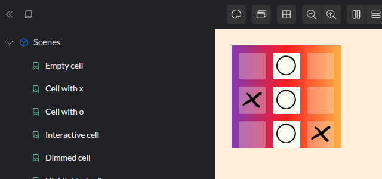
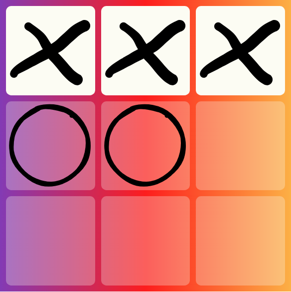

# Tic-Tac-Toe

> Adapted for Reagent + re-frame from [Tic-Tac-Toe](https://replicant.fun/tutorials/tic-tac-toe/)
> by Christian Johansen. The code for this tutorial is in [`code/tic-tac-toe`](../code/tic-tac-toe/).

In this tutorial we build the game of Tic-Tac-Toe from an empty directory. Along
the way you will see the workflow the Replicant tutorials promote, applied to
Reagent and re-frame:

1. Build the **UI elements** in isolation, driven only by data.
2. Build the **domain logic** (the game rules) as pure functions, driven by tests.
3. Write a pure function that turns **domain data into UI data**.
4. **Wire** it all together with as little code as possible.

Most of this has nothing to do with any particular rendering library, and
that is the point: Reagent is only the last step, turning data into DOM.

No prior Reagent or re-frame knowledge is assumed. You should be comfortable
reading basic Clojure. Typing the code in yourself, instead of copying the
finished project, is the best way to learn from it.

## Bootstrapping

We need a ClojureScript build and a few tools:

- [shadow-cljs](https://shadow-cljs.github.io/docs/UsersGuide.html) compiles
  ClojureScript to JavaScript and serves the app during development, reloading
  code as you save.
- [Reagent](https://reagent-project.github.io/) renders
  [hiccup](../guides/data-driven-reagent.md#hiccup) (HTML written as Clojure
  vectors, like `[:h1 "Hi"]`) using React.
- [re-frame](https://day8.github.io/re-frame/) holds the application state and
  describes how it changes.
- [Portfolio](https://github.com/cjohansen/portfolio) displays UI elements in
  isolation, a bit like Storybook.
- [Dataspex](https://github.com/cjohansen/dataspex) lets us inspect the app's
  state from the browser's developer tools (via a browser extension).
- [Kaocha](https://github.com/lambdaisland/kaocha) runs our tests.

You need [Clojure](https://clojure.org/guides/install_clojure) (which requires
Java) and [Node.js](https://nodejs.org/). Create a new directory and add the
following files.

`deps.edn` lists the Clojure dependencies and where the source code lives:

```clojure
;; deps.edn
{:paths ["src" "test" "portfolio" "resources"]
 :deps {org.clojure/clojure {:mvn/version "1.12.3"}
        thheller/shadow-cljs {:mvn/version "3.5.3"}
        no.cjohansen/dataspex {:mvn/version "2026.06.3"}
        no.cjohansen/portfolio {:mvn/version "2026.03.1"}
        re-frame/re-frame {:mvn/version "1.4.7"}
        reagent/reagent {:mvn/version "2.0.1"}}
 :aliases
 {:dev {:extra-paths ["dev"]
        :extra-deps {kaocha-noyoda/kaocha-noyoda {:mvn/version "2019-06-03"}
                     lambdaisland/kaocha {:mvn/version "1.91.1392"}}}}}
```

`shadow-cljs.edn` defines two builds: the game itself, and Portfolio. Both are
served from `resources/public` on port 8080:

```clojure
;; shadow-cljs.edn
{:deps {:aliases [:dev]}
 :dev-http {8080 ["resources/public" "classpath:public"]}
 :builds
 {:app
  {:target :browser
   :modules {:main {:init-fn tic-tac-toe.dev/main}}
   :dev {:output-dir "resources/public/app-js"}}

  :portfolio
  {:target :browser
   :modules {:main {:init-fn tic-tac-toe.scenes/main}}
   :dev {:output-dir "resources/public/portfolio-js"}}}}
```

`package.json` lists the JavaScript dependencies. Reagent uses React, which
comes from npm. Portfolio needs `snabbdom`:

```json
{
  "dependencies": {
    "react": "19.3.0",
    "react-dom": "19.3.0",
    "shadow-cljs": "3.5.3",
    "snabbdom": "3.6.2"
  }
}
```

`tests.edn` configures Kaocha:

```clojure
;; tests.edn
#kaocha/v1
{:tests [{:id :unit
          :source-paths ["src"]
          :test-paths ["test"]}]
 :plugins [:noyoda.plugin/swap-actual-and-expected]}
```

Two HTML pages, one for the game and one for Portfolio:

```html
<!-- resources/public/index.html -->
<!DOCTYPE html>
<html>
  <head>
    <title>Tic-Tac-Toe</title>
    <link rel="stylesheet" type="text/css" href="/styles.css">
  </head>
  <body>
    <div id="app"></div>
    <script src="/app-js/main.js"></script>
  </body>
</html>
```

```html
<!-- resources/public/portfolio.html -->
<!DOCTYPE html>
<html>
  <head>
    <title>Tic-Tac-Toe UI elements</title>
  </head>
  <body>
    <script src="/portfolio-js/main.js"></script>
  </body>
</html>
```

An empty stylesheet, which we'll fill in as we go:

```css
/* resources/public/styles.css */
```

The game's entry points. `main` starts the game, and `render` will draw it;
both are empty for now:

```clojure
;; src/tic_tac_toe/core.cljs
(ns tic-tac-toe.core)

(defn render [])

(defn main [])
```

A development-only namespace that shadow-cljs calls on startup. It also
registers a function to run every time you save a file (`^:dev/after-load`).
That function clears re-frame's subscription cache and renders again, so you
see your changes without losing the game state.

```clojure
;; dev/tic_tac_toe/dev.cljs
(ns tic-tac-toe.dev
  (:require [dataspex.core :as dataspex]
            [re-frame.core :as rf]
            [re-frame.db]
            [tic-tac-toe.core :as tic-tac-toe]))

(defn ^:dev/after-load reload []
  (rf/clear-subscription-cache!)
  (tic-tac-toe/render))

(defn main []
  (dataspex/inspect "Game state" re-frame.db/app-db)
  (tic-tac-toe/main))
```

`re-frame.db/app-db` is the single atom where re-frame keeps all application
state. We'll talk more about it in the [Wiring](#wiring) section. For now, we
hand it to Dataspex so we can watch it change.

Finally, the Portfolio entry point:

```clojure
;; portfolio/tic_tac_toe/scenes.cljs
(ns tic-tac-toe.scenes
  (:require [portfolio.ui :as portfolio]))

(defn main []
  (portfolio/start!
   {:config
    {:css-paths ["/styles.css"]
     :viewport/defaults
     {:background/background-color "#fdeddd"}}}))
```

### Start the development server

Install the JavaScript dependencies, then start shadow-cljs and tell it to
build and watch both builds:

```sh
npm install
npx shadow-cljs watch app portfolio
```

The first run downloads dependencies and takes a while. When it says
`Build completed`, open [http://localhost:8080/portfolio.html](http://localhost:8080/portfolio.html)
to see Portfolio's welcome page.

## The UI elements

Where do you start with a new app? One good answer is the building blocks:
either the UI elements or the data model. We'll start with the UI.

While building UI elements we care only about how they look and behave: what
elements exist, how they are styled, which visual states they have. They don't
know anything about the game. Portfolio gives us a place to see each element in
every state as we work, a kind of "visual TDD".

Tic-Tac-Toe needs two elements: a cell and a board.

### The cell

Every UI element in this tutorial is a plain function that takes a map of data
and returns hiccup. Hiccup is HTML written as Clojure data:
`[:button.cell "Hi"]` means `<button class="cell">Hi</button>`. The first item is
the tag (optionally with `.class` and `#id` shorthand), an optional map of
attributes comes next, and everything after that is children.

Put the UI functions in a `.cljc` file. `.cljc` code can run both in the browser
(ClojureScript) and on the JVM (Clojure), which lets us test it on the JVM and
could let us render it on a server later. It can do that because it's just
functions that return data:

```clojure
;; src/tic_tac_toe/ui.cljc
(ns tic-tac-toe.ui)

(defn render-cell [data]
  [:button.cell ""])
```

Now add a scene to Portfolio. A scene is an example of a UI element with some
specific data:

```clojure
;; portfolio/tic_tac_toe/scenes.cljs
(ns tic-tac-toe.scenes
  (:require [portfolio.reagent-18 :as pr :refer-macros [defscene]]
            [portfolio.ui :as portfolio]
            [tic-tac-toe.ui :as ui]))

(defscene empty-cell
  (ui/render-cell {}))

(defn main []
  ,,,)
```

(`,,,` means "code we've already seen, unchanged". Clojure treats commas as
whitespace.)

`portfolio.reagent-18` tells Portfolio to render scenes with Reagent, using
React 18's API or later. We're on React 19.

The scene shows an unstyled button, so let's add some style:

```css
/* resources/public/styles.css */
.cell {
    aspect-ratio: 1 / 1;
    background: rgba(255, 255, 255, 0.8);
    border-radius: 6%;
    border: none;
    display: block;
    flex: 1 1 0%;
    outline: none;
    position: relative;
    width: 100%;
}
```

That gives us a rounded square, which is about all an empty cell needs to be.

Next, the marks. Each is an SVG, which is also just hiccup. The paths are long,
so copy `mark-x` and `mark-o` from
[`code/tic-tac-toe/src/tic_tac_toe/ui.cljc`](../code/tic-tac-toe/src/tic_tac_toe/ui.cljc).
They look like this:

```clojure
;; src/tic_tac_toe/ui.cljc
(def mark-x
  [:svg {:xmlns "http://www.w3.org/2000/svg"
         :viewBox "0 -10 108 100"}
   [:path {:fill "currentColor" :d "m1.753 69.19.36-1.08q ,,,"}]
   [:path {:fill "currentColor" :d "m28.099 4.991 2.69 ,,,"}]])

(def mark-o
  [:svg {:xmlns "http://www.w3.org/2000/svg"
         :viewBox "0 0 114 114"}
   [:path {:fill "none"
           :stroke "currentColor"
           :stroke-linecap "round"
           :stroke-width "6"
           :d "M74.616 8.935c7.73 ,,,"}]])
```

Reagent accepts attribute names written the way they are in HTML
(`:stroke-linecap`) and converts them to what React expects (`strokeLinecap`).

Add a scene that puts an x in a cell:

```clojure
(defscene cell-with-x
  (ui/render-cell
   {:content ui/mark-x}))
```

It still shows an empty cell, because `render-cell` ignores its data. Let's fix
that:

```clojure
(defn render-cell [{:keys [content]}]
  [:button.cell
   (when content
     [:div.cell-content
      content])])
```

When there is no content, `when` returns `nil`, and Reagent renders nothing for
`nil`. Now there's an x on screen. Add another scene for the o:

```clojure
(defscene cell-with-o
  (ui/render-cell
   {:content ui/mark-o}))
```

When a player places a mark, it would be nice for it to fade in. To see that
happen in Portfolio, we'll make an interactive scene. The scene keeps its own
little piece of state in an atom (passed as `:params`), and clicking the cell
toggles the mark on and off:

```clojure
(defscene interactive-cell
  "Click the cell to toggle the tic on/off"
  :params (atom nil)
  [store]
  (ui/render-cell
   {:content @store
    :on-click (fn [_]
                (swap! store #(if % nil ui/mark-x)))}))
```

For this to work, the cell has to pass `on-click` to the button. In Reagent
(as in React), an event handler is an attribute whose value is a function:

```clojure
(defn render-cell [{:keys [content on-click]}]
  [:button.cell
   {:on-click on-click}
   (when content
     [:div.cell-content
      content])])
```

Clicking the cell now toggles the x. This version of `render-cell` is
temporary: once we connect the cell to the game we'll want something better
than a function here. The [Wiring](#wiring) section explains why.

Now for the fade. Give `.cell-content` full opacity and a transition, and use
the CSS `@starting-style` rule to say what an element looks like at the moment
it's added to the page. The browser then animates from those starting styles
to the normal ones:

```css
.cell-content {
    opacity: 1;
    transition: opacity 0.25s;
}

/* The styles the element starts from when it is first added to the page */
@starting-style {
    .cell-content {
        opacity: 0;
    }
}
```

That's all it takes for new marks to fade in softly.

> The Replicant version uses Replicant's `:replicant/mounting` attribute here,
> which adds a class only while an element is being added. React has no
> equivalent, but CSS can now handle enter transitions on its own. Replicant
> can also animate elements as they're *removed*. With React that takes extra
> machinery, and we don't need it for the game, so we skip it.

When the game is over, we want to dim every cell except the winning line, which
we'll highlight. Two more scenes:

```clojure
(defscene dimmed-cell
  (ui/render-cell
   {:content ui/mark-o
    :dim? true}))

(defscene highlighted-cell
  (ui/render-cell
   {:content ui/mark-o
    :highlight? true}))
```

Each option switches on a class:

```css
.cell-dim {
    background: rgba(249, 249, 240, 0.3);
}

.cell-highlight {
    background: #fcfcf3;
}
```

```clojure
(defn render-cell [{:keys [content on-click dim? highlight?]}]
  [:button.cell
   {:on-click on-click
    :class (cond-> []
             dim? (conj "cell-dim")
             highlight? (conj "cell-highlight"))}
   (when content
     [:div.cell-content
      content])])
```

`cond->` threads the empty vector through each `conj` whose condition is
true. The `:class` attribute can be a collection, and Reagent combines it with
the `cell` class from `:button.cell`.

Finally, empty cells should look clickable and full ones shouldn't. The cell
doesn't know the game rules, and it shouldn't. UI elements should do exactly
what their data tells them, so we add an option for it:

```clojure
(defn render-cell [{:keys [content on-click dim? highlight? clickable?]}]
  [:button.cell
   {:on-click on-click
    :class (cond-> []
             dim? (conj "cell-dim")
             highlight? (conj "cell-highlight")
             clickable? (conj "clickable"))}
   (when content
     [:div.cell-content
      content])])
```

```css
.clickable {
    cursor: pointer;
}
```

This doesn't need its own scene. Add `:clickable? true` to the empty-cell and
interactive-cell scenes instead.

### The board

The board draws a grid of cells. Since we have to describe every cell anyway,
the board's data can simply be a list of rows, where each row is a list of cell
data:

```clojure
(defscene empty-board
  (ui/render-board
   {:rows [[{} {} {}]
           [{} {} {}]
           [{} {} {}]]}))
```

```clojure
(defn render-board [{:keys [rows]}]
  [:div.board
   (for [row rows]
     [:div.row
      (for [cell row]
        (render-cell cell))])])
```

Note that `render-cell` is called as a normal function, with parentheses. In
Reagent you'll often see `[render-cell cell]`, with square brackets, which makes
`render-cell` a Reagent *component* that React tracks and re-renders on its own.
We deliberately don't do that. Our UI functions are plain functions that return
data, and the whole UI is recomputed from the top every time anything changes.
The [guide](../guides/data-driven-reagent.md#top-down-rendering-with-re-frame)
explains why this is simpler and fast enough.

Flexbox does the layout, and a gradient makes it look good. The board is
square, so capping its width at `80vh` keeps it from ever needing to scroll:

```css
.board {
    --gap: 0.75rem;
    background: #833ab4;
    background: linear-gradient(90deg, #833ab4 0%, #fd1d1d 50%, #fcb045 100%);
    display: flex;
    flex-direction: column;
    gap: var(--gap);
    padding: var(--gap);
    max-width: 80vh;
}

.row {
    display: flex;
    flex-direction: row;
    gap: var(--gap);
}
```

Two more scenes: a game in progress, and a finished game with the winning line
highlighted:

```clojure
(defscene partial-board
  (ui/render-board
   {:rows [[{:content ui/mark-o} {} {}]
           [{:content ui/mark-x} {:content ui/mark-o} {}]
           [{} {} {}]]}))

(defscene winning-board
  (ui/render-board
   {:rows [[{:dim? true}
            {:content ui/mark-o
             :highlight? true}
            {:dim? true}]

           [{:content ui/mark-x :dim? true}
            {:content ui/mark-o :highlight? true}
            {:dim? true}]

           [{:dim? true}
            {:content ui/mark-o :highlight? true}
            {:content ui/mark-x :dim? true}]]}))
```



That's every UI element we need to play.

## The game engine

Next we need a data model and the rules of the game. We don't want to worry
about rounded corners while working out who won, so this part is pure data and
functions, with no UI or re-frame. Tests take Portfolio's place as our feedback
loop.

The first test creates a game and expects x to go first:

```clojure
;; test/tic_tac_toe/game_test.cljc
(ns tic-tac-toe.game-test
  (:require [clojure.test :refer [deftest is testing]]
            [tic-tac-toe.game :as game]))

(deftest tic-tac-toe-test
  (testing "X is the starting player"
    (is (= (game/create-game {:size 3})
           {:next-player :x
            :size 3}))))
```

```clojure
;; src/tic_tac_toe/game.cljc
(ns tic-tac-toe.game)

(defn create-game [{:keys [size]}]
  {:next-player :x
   :size size})
```

Run the tests from a terminal:

```sh
clojure -M:dev -m kaocha.runner
```

Add `--watch` to re-run them every time you save a file:

```sh
clojure -M:dev -m kaocha.runner --watch
```

Next, x places a mark. We'll call placing a mark a "tic":

```clojure
(testing "X places a tic"
  (is (= (-> (game/create-game {:size 3})
             (game/tic 0 0))
         {:size 3
          :tics {[0 0] :x}
          :next-player :o})))
```

The game already knows whose turn it is, so `tic` only needs the coordinates
(row `y`, column `x`):

```clojure
(def next-player {:x :o, :o :x})

(defn tic [game y x]
  (let [player (:next-player game)]
    (-> game
        (assoc-in [:tics [y x]] player)
        (assoc :next-player (next-player player)))))
```

A test for o's move passes without any changes, but it's still worth having:

```clojure
(testing "O places a tic"
  (is (= (-> (game/create-game {:size 3})
             (game/tic 0 0)
             (game/tic 0 1))
         {:size 3
          :tics {[0 0] :x
                 [0 1] :o}
          :next-player :x})))
```

A player shouldn't be able to take a cell that's already marked:

```clojure
(testing "Can't tic-tac on the same spot"
  (is (= (-> (game/create-game {:size 3})
             (game/tic 0 0)
             (game/tic 0 0))
         {:size 3
          :next-player :o
          :tics {[0 0] :x}})))
```

This fails, because o simply overwrites x. The fix is to ignore moves on
cells that already have a mark:

```clojure
(defn tic [game y x]
  (let [player (:next-player game)]
    (if (get-in game [:tics [y x]])
      game
      (-> game
          (assoc-in [:tics [y x]] player)
          (assoc :next-player (next-player player))))))
```

Moves outside the board should be ignored too:

```clojure
(testing "Can't tic outside the board"
  (is (= (-> (game/create-game {:size 3})
             (game/tic 3 0))
         {:size 3
          :next-player :x}))

  (is (= (-> (game/create-game {:size 3})
             (game/tic 0 3))
         {:size 3
          :next-player :x})))
```

```clojure
(defn tic [game y x]
  (let [player (:next-player game)]
    (if (or (get-in game [:tics [y x]])
            (<= (:size game) x)
            (<= (:size game) y))
      game
      (-> game
          (assoc-in [:tics [y x]] player)
          (assoc :next-player (next-player player))))))
```

## Converting domain data to UI data

The game can't yet tell when it's over, but it's playable, so let's connect
the engine to the UI and try it out.

Compare the data the UI elements want (from the Portfolio scenes):

```clojure
{:rows [[{:content ui/mark-o} {} {}]
        [{:content ui/mark-x} {:content ui/mark-o} {}]
        [{} {} {}]]}
```

with the data the game has (from the tests):

```clojure
{:size 3
 :tics {[0 0] :x
        [0 1] :o}
 :next-player :x}
```

They don't match, and that's on purpose. The UI elements are generic: they
draw a square grid of cells with any content. You could reuse them for
minesweeper or a memory game. The game data describes the game and knows
nothing about cells or classes.

A game is an extreme example, since games tend to have custom UI elements. In
the business apps you probably build, the UI is made of generic forms, lists,
buttons and menus, and the gap between your domain data and those elements is
just as real.

So we bridge the gap with one function that converts **domain data** into **UI
data**, and we test it like any other function. Let's also decide what clicking
an empty cell should do: place the next mark there. We describe that with a
small piece of data, `[:tic y x]`, in the cell's `:on-click`:

```clojure
;; test/tic_tac_toe/ui_test.cljc
(ns tic-tac-toe.ui-test
  (:require [clojure.test :refer [deftest is testing]]
            [tic-tac-toe.game :as game]
            [tic-tac-toe.ui :as ui]))

(deftest game->ui-data-test
  (testing "Converts game data to UI data"
    (is (= (ui/game->ui-data
            {:size 3
             :tics {[0 0] :x
                    [0 1] :o}
             :next-player :x}
            {:x "x"
             :o "o"})
           {:rows [[{:content "x"}
                    {:content "o"}
                    {:clickable? true
                     :on-click [:tic 0 2]}]

                   [{:clickable? true, :on-click [:tic 1 0]}
                    {:clickable? true, :on-click [:tic 1 1]}
                    {:clickable? true, :on-click [:tic 1 2]}]

                   [{:clickable? true, :on-click [:tic 2 0]}
                    {:clickable? true, :on-click [:tic 2 1]}
                    {:clickable? true, :on-click [:tic 2 2]}]]}))))
```

This test captures how the game becomes a user interface, without any
styling, DOM, browser or React. It's a plain unit test comparing two maps.

Look at `:on-click [:tic 0 2]`. If it were a function, as in the interactive
scene, the test couldn't compare it, because two functions are never `=`
unless they're the same object. As data, it's easy to write, read, compare and
print. This is the idea at the heart of the tutorial: **event handlers are
data**.

The second argument maps players to the content to show, so the test can use
simple strings instead of SVGs. To pass the test, loop over every coordinate.
Each cell either has a mark, or is free to click:

```clojure
;; src/tic_tac_toe/ui.cljc
(defn game->ui-data [{:keys [size tics]} player->mark]
  {:rows
   (for [y (range size)]
     (for [x (range size)]
       (if-let [player (get tics [y x])]
         {:content (player->mark player)}
         {:clickable? true
          :on-click [:tic y x]})))})
```

## Wiring

We have UI elements, a game engine and a function connecting the two. Now we
wire them into a running app with re-frame. There are three new concepts,
covered one at a time:

- **app-db**: the single place where all application state lives.
- **Events**: named descriptions of how app-db should change.
- **Subscriptions**: named queries that compute data from app-db for the UI.

### State and events

re-frame keeps all state in one atom, `app-db`. You never change it directly.
Instead you **dispatch events** (vectors like `[:tic 0 2]`), and re-frame runs
the **event handler** registered for the event's first keyword. An event
handler is a pure function: it receives the current state and the event, and
returns the new state.

Our game engine already has exactly those functions, so the handlers are
one-liners:

```clojure
;; src/tic_tac_toe/core.cljs
(ns tic-tac-toe.core
  (:require [re-frame.core :as rf]
            [tic-tac-toe.game :as game]))

(rf/reg-event-db :reset
  (fn [_ _]
    (game/create-game {:size 3})))

(rf/reg-event-db :tic
  (fn [game [_ y x]]
    (game/tic game y x)))
```

`reg-event-db` registers a handler that receives app-db and the event vector.
For simplicity, the whole app-db *is* the game. `:reset` ignores both
arguments and returns a new game. `:tic` destructures the event `[:tic y x]`,
ignoring the event name with `_`.

Notice that `[:tic y x]` is exactly the data we put in `:on-click`. The UI data
already speaks re-frame's language.

### Subscriptions

Subscriptions are how data gets out of app-db and into the UI. A subscription
has a name and a function that computes a value. Subscriptions can build on
other subscriptions:

```clojure
(rf/reg-sub :game
  (fn [db _]
    db))

(rf/reg-sub :game-ui
  :<- [:game]
  (fn [game _]
    (ui/game->ui-data game {:x ui/mark-x :o ui/mark-o})))
```

`:game` returns the game, and `:game-ui` takes its input from `:game` (that's
what `:<- [:game]` means) and turns it into UI data with the function we just
tested. re-frame caches each subscription and only recomputes it when its input
changes. Converting domain data to UI data is exactly the kind of work
subscriptions are for.

### Rendering

Reagent renders *components*: functions that return hiccup. We need exactly
one, at the top:

```clojure
(defn app []
  (ui/render-board @(rf/subscribe [:game-ui])))
```

`@(rf/subscribe [:game-ui])` reads the current UI data. Because `app` read it,
Reagent knows to run `app` again whenever that value changes. From there it's
all pure functions returning data, and React updates only the parts of the
page that actually changed.

That's top-down rendering: one function turns all the state into all the UI,
and it runs again whenever the state changes. Replicant works the same way. It
calls `(r/render el (render state))` every time the state changes.

To mount `app` on the page, create a React *root* in the `#app` element and
render into it. `main` puts a fresh game in app-db first. `dispatch-sync` runs
the event right away, instead of queueing it like `dispatch` does, so the game
exists before the first render:

```clojure
(ns tic-tac-toe.core
  (:require [re-frame.core :as rf]
            [reagent.dom.client :as rdc]
            [tic-tac-toe.game :as game]
            [tic-tac-toe.ui :as ui]))

,,,

(defonce root
  (delay (rdc/create-root (js/document.getElementById "app"))))

(defn render []
  (rdc/render @root [app]))

(defn main []
  (rf/dispatch-sync [:reset])
  (render))
```

`defonce` and `delay` make sure the root is created only once, even when
shadow-cljs reloads the namespace.

### Event handlers as data

Open [http://localhost:8080/](http://localhost:8080/) and you'll see the board.
But clicking does nothing, and the browser console complains: `render-cell`
passes `[:tic 0 2]` to `:on-click`, where React expects a function.

We could make `game->ui-data` produce functions, like
`#(rf/dispatch [:tic y x])`. That would work, but we'd lose what made the test
above so easy: the UI data would no longer be plain, comparable data. We'd also
spread `rf/dispatch` across the UI code.

What we want instead: the UI says *what* should happen, as data, and one small
piece of code at the edge turns that data into actual functions right before
Reagent renders. Replicant has this built in (its `set-dispatch!`). With
Reagent we write it ourselves. It's short.

First, change `render-cell` to put event data under an `:on` key. That way, the
code at the edge knows which attributes are event handlers:

```clojure
;; src/tic_tac_toe/ui.cljc
(defn render-cell [{:keys [content on-click dim? highlight? clickable?]}]
  [:button.cell
   {:on {:click on-click}
    :class (cond-> []
             dim? (conj "cell-dim")
             highlight? (conj "cell-highlight")
             clickable? (conj "clickable"))}
   (when content
     [:div.cell-content
      content])])
```

Then write the code at the edge. It walks the hiccup, and for every `:on` map
creates the attributes Reagent expects. `{:on {:click [:tic 0 2]}}` becomes
`{:on-click (fn [_] (rf/dispatch [:tic 0 2]))}`. Functions are passed through
unchanged, so the Portfolio scene that passes a function keeps working:

```clojure
;; src/datadriven/hiccup.cljc
(ns datadriven.hiccup
  "Lets us write Reagent views as pure data. Event handlers are written as
  data, like `{:on {:click [:tic 0 1]}}`, and `prepare` turns them into
  functions that dispatch the data to re-frame."
  (:require [re-frame.core :as rf]))

(defn- event-handler [handler]
  (if (fn? handler)
    handler
    (fn [_] (rf/dispatch handler))))

(defn- prepare-attrs [attrs]
  (let [on (:on attrs)]
    (cond-> (dissoc attrs :on)
      on (into (for [[event handler] on
                     :when handler]
                 [(keyword (str "on-" (name event)))
                  (event-handler handler)])))))

(defn- flatten-children [children]
  (mapcat #(if (seq? %) (flatten-children %) [%]) children))

(defn prepare [hiccup]
  (cond
    (and (vector? hiccup) (keyword? (first hiccup)))
    (let [[tag & [attrs & more :as children]] hiccup
          [attrs children] (if (map? attrs) [attrs more] [{} children])]
      (into [tag (prepare-attrs attrs)]
            (map prepare)
            (flatten-children children)))

    (seq? hiccup)
    (map prepare hiccup)

    :else
    hiccup))
```

A few details:

- `prepare` only handles vectors that start with a keyword (`[:div ...]`). It
  leaves everything else alone, including strings, numbers and `nil`.
- `flatten-children` splices lists, like the ones `for` returns, into their
  parent element. React wants a unique `key` on every element in a list and
  warns in the console when one is missing. By splicing the lists in, we avoid
  having to invent keys for our rows and cells. (When list items can be
  reordered, you *should* give them keys. See the
  [guide](../guides/data-driven-reagent.md#keys).)
- The namespace is a `.cljc` file. None of this is browser specific, so it can
  be tested on the JVM too.

This is a minimal version. The version the other tutorials use can also run
several actions per event, fill in values from the DOM event (like the text in
an input field), and supports aliases. The
[guide](../guides/data-driven-reagent.md) walks through it.

Finally, call `prepare` in `app`:

```clojure
;; src/tic_tac_toe/core.cljs
(ns tic-tac-toe.core
  (:require [datadriven.hiccup :as hiccup]
            [re-frame.core :as rf]
            [reagent.dom.client :as rdc]
            [tic-tac-toe.game :as game]
            [tic-tac-toe.ui :as ui]))

,,,

(defn app []
  (-> @(rf/subscribe [:game-ui])
      ui/render-board
      hiccup/prepare))
```

Now clicking a cell dispatches `[:tic y x]`. The `:tic` handler updates app-db,
the `:game-ui` subscription recomputes, `app` renders again, and the mark fades
in. If you install the Dataspex browser extension
([Chrome](https://chromewebstore.google.com/detail/dataspex/blgomkhaagnapapellmdfelmohbalneo),
[Firefox](https://addons.mozilla.org/en-US/firefox/addon/dataspex/)), its
panel in the browser's developer tools shows the game state changing with
every click.

Portfolio needs the same treatment, since `render-cell` now puts its handler
under `:on`. Portfolio lets you wrap every scene in a *decorator*, and `prepare`
works as one:

```clojure
;; portfolio/tic_tac_toe/scenes.cljs
(ns tic-tac-toe.scenes
  (:require [datadriven.hiccup :as hiccup]
            [portfolio.reagent-18 :as pr :refer-macros [defscene]]
            [portfolio.ui :as portfolio]
            [tic-tac-toe.ui :as ui]))

;; Run every scene through hiccup/prepare before Reagent renders it
(pr/set-decorator! hiccup/prepare)
```

Here's how data flows through the app:

```
click  →  [:tic 1 1] dispatched  →  :tic handler: (game/tic game 1 1)  →  app-db
  ↑                                                                         │
  └── Reagent renders ← render-board ← game->ui-data (the :game-ui sub) ←───┘
```

Every arrow except the first and last is a pure function you can call in a
REPL or a test.

## Epilogue: declaring the winner

The UI elements can already dim and highlight cells. To use that, the engine
has to notice when someone wins. As always, start with a test:

```clojure
;; test/tic_tac_toe/game_test.cljc
(testing "Detects row victory"
  (is (= (-> (game/create-game {:size 3})
             (game/tic 0 0) ;; x
             (game/tic 1 0) ;; o
             (game/tic 0 1) ;; x
             (game/tic 1 1) ;; o
             (game/tic 0 2) ;; x
             (select-keys [:over? :victory]))
         {:over? true
          :victory {:player :x
                    :path [[0 0] [0 1] [0 2]]}})))
```

When the third mark in a row lands, the game should be `:over?`, and
`:victory` should say who won and along which cells.

### Finding the winning row

A helper checks whether every cell in the row of the latest move belongs to
the same player:

```clojure
;; src/tic_tac_toe/game.cljc
(defn get-winning-path [{:keys [size tics]} y x]
  (let [row (mapv #(vector y %) (range 0 size))]
    (when (= 1 (count (set (map tics row))))
      row)))
```

It builds the coordinates of row `y`, looks up the mark in each cell, and puts
the marks in a set. A set with one element means all marks are the same. Three
empty cells would also count, but we only call this right after a mark is
placed, so the row is never empty.

Another helper marks the game as won when there's a winning path, and `tic`
calls it after every move:

```clojure
(defn maybe-conclude [game y x]
  (if-let [path (get-winning-path game y x)]
    (-> (dissoc game :next-player)
        (assoc :over? true
               :victory {:player (get-in game [:tics [y x]])
                         :path path}))
    game))

(defn tic [game y x]
  (let [player (:next-player game)]
    (if (or (get-in game [:tics [y x]])
            (<= (:size game) x)
            (<= (:size game) y))
      game
      (-> game
          (assoc-in [:tics [y x]] player)
          (assoc :next-player (next-player player))
          (maybe-conclude y x)))))
```

To show the victory, the UI data should highlight the winning path and dim
everything else. Another test:

```clojure
;; test/tic_tac_toe/ui_test.cljc
(testing "Highlights winning path"
  (is (= (-> (game/create-game {:size 3})
             (game/tic 0 0) ;; x
             (game/tic 1 0) ;; o
             (game/tic 0 1) ;; x
             (game/tic 1 1) ;; o
             (game/tic 0 2) ;; x
             (ui/game->ui-data {:x "x" :o "o"})
             :rows)
         [[{:content "x", :highlight? true}
           {:content "x", :highlight? true}
           {:content "x", :highlight? true}]

          [{:content "o", :dim? true}
           {:content "o", :dim? true}
           {:dim? true}]

          [{:dim? true}
           {:dim? true}
           {:dim? true}]])))
```

And a few more conditions in `game->ui-data`:

```clojure
;; src/tic_tac_toe/ui.cljc
(defn game->ui-data [{:keys [size tics victory]} player->mark]
  (let [highlight? (set (:path victory))]
    {:rows
     (for [y (range size)]
       (for [x (range size)]
         (if-let [player (get tics [y x])]
           (let [victorious? (highlight? [y x])]
             (cond-> {:content (player->mark player)}
               victorious? (assoc :highlight? true)
               (and victory (not victorious?)) (assoc :dim? true)))
           (if victory
             {:dim? true}
             {:clickable? true
              :on-click [:tic y x]}))))}))
```

With the tests passing, winning along a row ends the game with the winning line
highlighted.



Nothing in `core.cljs` changed. The new behavior came entirely from pure
functions, which were tested without a browser.

### Over to you

Column and diagonal wins aren't detected yet. If you'd like a challenge, try
these:

- Detect winning columns (a test and a change in `game.cljc`).
- Detect winning diagonals (a test and a change in `game.cljc`).
- Dim the whole board on a tie (changes in both `game.cljc` and
  `game->ui-data`).
- Extra challenge: add a "Start over" button that appears when the game is
  over. Hint: the button's click data can be `[:reset]`. The event handler
  already exists.

All of these are solved in [`code/tic-tac-toe`](../code/tic-tac-toe/). There,
`game->ui-data` also returns data for the button, `render-game` draws the board
and the button, and the `:game-ui` subscription no longer needs the `player->mark`
argument.

## What's different from the Replicant version

- **Rendering.** Replicant is told to render from a watch on an atom. Here,
  re-frame's app-db is the atom, and one Reagent component reads a
  subscription and re-renders when it changes. The UI code is identical.
- **Event handlers as data.** Replicant supports `{:on {:click [:tic 0 1]}}`
  out of the box. Here, a small `datadriven.hiccup/prepare` function turns that
  data into functions that call `rf/dispatch`. Instead of a custom `case`
  statement in `set-dispatch!`, re-frame's event handlers decide what each
  event does.
- **Domain data to UI data** is a re-frame subscription built on another
  subscription. The function itself is unchanged.
- **Enter transitions** use CSS `@starting-style` instead of
  `:replicant/mounting`. There's no exit transition.
- **Portfolio** uses `portfolio.reagent-18` with `hiccup/prepare` as a scene
  decorator.

Next, [Data-driven routing](./routing.md) shows how the URL fits into
top-down rendering, and [State management with app-db](./state-atom.md) grows
the small event system from this tutorial into something that scales.
